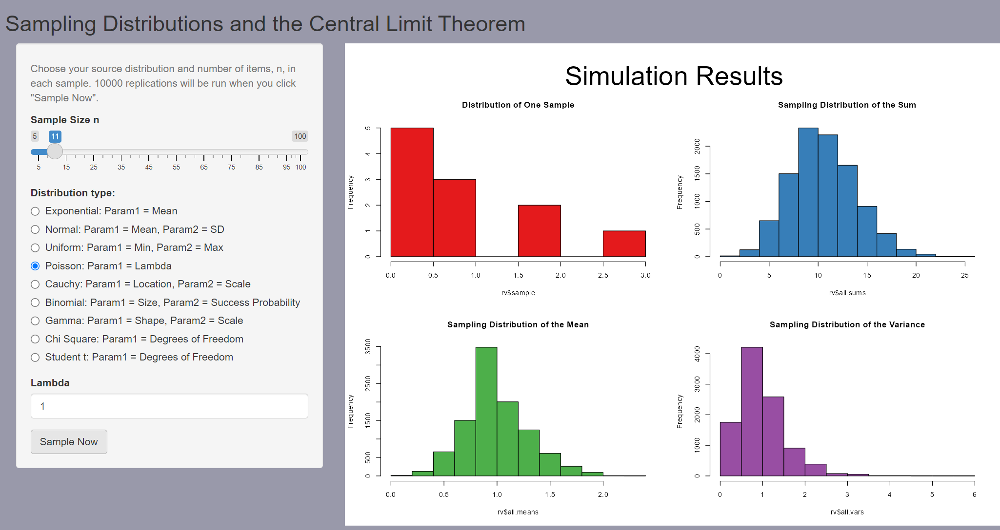
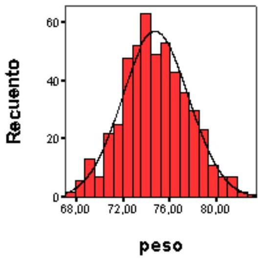

# Grandes muestras


## Introducción: Aproximaciones asintóticas

En estadística y teoría de la probabilidad, el estudio de las grandes muestras juega un papel crucial debido a su relevancia tanto en la definición frecuentista de probabilidad como en la construcción de estimadores en la práctica estadística. 

- Desde la perspectiva de la probabilidad frecuentista, la probabilidad se define como el límite de la frecuencia relativa de un evento cuando el número de ensayos tiende a infinito. 

- En el contexto de la estadística, las grandes muestras sirven como base para muchas aproximaciones importantes, como las distribuciones de muestreo, las estimaciones de parámetros y la validación de inferencias. 

La ley de los grandes números y el teorema central del límite son ejemplos clave de teoremas que se fundamentan en el comportamiento de las muestras grandes, proporcionando las bases para muchos de los métodos estadísticos utilizados en la inferencia moderna.

## Ley de los Grandes Números (Ley débil)

La **ley de los grandes números** establece que, a medida que el tamaño de la muestra aumenta, la media muestral se aproxima a la media de la población. 

Formalmente, la ley de los grandes números en su versión débil se enuncia de la siguiente manera:

Sea \(X_1, X_2, \dots, X_n\) una secuencia de variables aleatorias independientes e idénticamente distribuidas (i.i.d.) con esperanza \( \mu = \mathbb{E}[X_i] \) y varianza \( \sigma^2 = \text{Var}(X_i) \), entonces para cualquier \( \epsilon > 0 \),

\[
\lim_{n \to \infty} P \left( \left| \frac{1}{n} \sum_{i=1}^n X_i - \mu \right| \geq \epsilon \right) = 0.
\]

Esto significa que, con alta probabilidad, la media muestral \( \frac{1}{n} \sum_{i=1}^n X_i \) se aproxima a \( \mu \) a medida que \(n\) crece.

### Ejemplo

Imaginemos un dado equilibrado. Sabemos que la esperanza de cada lanzamiento es el valor promedio de los números en el dado, que es

\[
\mu = \frac{1+2+3+4+5+6}{6} = 3.5.
\]

Ahora, supongamos que lanzamos el dado repetidamente y calculamos la media de los resultados. Al principio, con pocos lanzamientos, la media puede estar alejada de 3.5, pero a medida que aumentan los lanzamientos, la media se acercará más y más a 3.5, como lo predice la ley de los grandes números. Es decir, a medida que lanzamos más veces el dado, la probabilidad de que la media de los resultados se aleje de 3.5 por más de una cantidad arbitraria disminuye.

Podemos ilustrarlo con el siguiente código de R

```{r}
# Definir la función para simular lanzamientos de un dado
simular_dado <- function(max_n) {
  medias <- numeric(max_n)  # Vector para almacenar las medias muestrales
  for (n in 1:max_n) {
    lanzamientos <- sample(1:6, n, replace = TRUE)  # Lanzar el dado n veces
    medias[n] <- mean(lanzamientos)  # Calcular la media de los lanzamientos
  }
  return(medias)
}

# Simular para un tamaño máximo de muestra de 10000 lanzamientos
max_n <- 10000
medias <- simular_dado(max_n)

# Graficar las medias muestrales a medida que n aumenta
png("images/LLN1.png")
plot(1:max_n, medias, type = "l", col = "blue", lwd = 2,
     xlab = "Número de lanzamientos (n)", ylab = "Media muestral",
     main = "Ley de los Grandes Números\n Media de los lanzamientos de un dado", cex.main=0.7)
abline(h = 3.5, col = "red", lwd = 2, lty = 2)  # Línea horizontal en 3.5
dev.off()
```

```{r, LLN1, out.width="90%", fig.align='center'}
knitr::include_graphics("images/LLN1.png",rel_path = TRUE)
```


Este comportamiento es una manifestación intuitiva de la ley débil de los grandes números, ya que nos garantiza que la media muestral se acercará a la media poblacional a medida que el número de observaciones aumente.


## El teorema central del límite

El teorema central del límite (a partir de ahora, TCL) presenta un doble interés. Por un lado, proporciona a la estadística un resultado crucial para abordar el estudio de la distribución asintótica de muchos tipos de variables aleatorias. Como se verá en próximos capítulos, va a resultar básico en la construcción de contrastes de hipótesis y de intervalos de confianza, dos herramientas esenciales en estadística aplicada.

Además, el TCL proporciona una explicación teórica fundamentada a un fenómeno habitual en experimentos reales: las variables estudiadas presentan muchas veces una distribución empírica aproximadamente normal.

El TCL forma parte de un conjunto de propiedades relativas a las convergencias de variables aleatorias. En este tema se estudia sólo un tipo de convergencia, la convergencia en ley, ya que es necesaria para entender el enunciado del TCL. Se descarta, pues, en este documento el estudio de los otros tipos de convergencias (en probabilidad, casi segura, etc.) y el estudio de las leyes de los grandes números.

Posiblemente el lector con poca formación en análisis matemático hallará alguna dificultad en la primera lectura de la definición de convergencia en ley y en el enunciado del TCL. Si es este el caso, los ejemplos incluidos han de ayudar en su comprensión. Consideramos al TCL un resultado básico con el que hay que familiarizarse, ya que se aplicará repetidamente en los próximos temas.

### Sumas de variables aleatorias

El TCL estudia el comportamiento de las sumas de variables aleatorias. En temas anteriores se han visto ya ejemplos de sumas de variables aleatorias.

Formalmente, la suma de dos variables aleatorias corresponde a la siguiente aplicación: si $X_{1}$ y $X_{2}$ son dos variables aleatorias definidas sobre $\Omega$, la suma es:

$$
\begin{aligned}
X_{1}+X_{2}: & \Omega \rightarrow \mathbb{R} \\
& \omega \mapsto X_{1}(\omega)+X_{2}(\omega)
\end{aligned}
$$

La suma de dos variables puede extenderse sin dificultad a sumas de tres, cuatro,... y, en general, $n$ variables aleatorias.

El TCL se ocupa de las sucesiones de variables aleatorias. En el contexto del TCL una sucesión corresponde a un conjunto donde el primer elemento es una variable aleatoria, el segundo elemento es la suma de dos variables aleatorias, el tercero es la suma de tres variables aleatorias, y así sucesivamente.

Una sucesión es un conjunto de elementos infinitos, que se designan simbólicamente mediante $\left\{X_{n}\right\}$.
Cada uno de los elementos de la sucesión (que es una variable aleatoria) lleva asociada una determinada función de distribución:

$$
X_{n} \rightarrow F_{n}
$$

Así pues, la sucesión de variables aleatorias lleva asociada una secuencia paralela de funciones de distribución.

<!-- En los ejemplos se presentan sumas de variables aleatorias de diferentes tipos. -->

<!-- #### Presentación de los ejemplos -->

<!-- 1. Ejemplo 1: sumas de variables binomiales. -->
<!-- 2. Ejemplo 2: sumas de variables Poisson. -->
<!-- 3. Ejemplo 3: sumas de $n$ puntuaciones de dados. -->
<!-- 4. Ejemplo 4: sumas de variables uniformes. -->
<!-- 5. Ejemplo 5: sumas de variables exponenciales. -->

### Definición de convergencia en ley

La siguiente definición se ocupa del comportamiento de las sucesiones.
Sea $\left\{X_{n}\right\}$ una sucesión de variables aleatorias, y sea $\left\{F_{n}\right\}$ la correspondiente sucesión de funciones de distribución. Se dice que $\left\{X_{n}\right\}$ converge en ley a una variable aleatoria $X$ de función de distribución $F$ si:

$$
\lim _{n \rightarrow \infty} F_{n}(x)=F(x) \quad \text { para todo } \mathrm{x} \text { donde } F \text { es contínua. }
$$

Se indica que la sucesión converge en ley mediante el símbolo:

$$
X_{n} \stackrel{\mathrm{L}}{\rightarrow} X
$$

El significado de la definición es que, al aumentar arbitrariamente $n$, las sucesivas funciones de distribución de la secuencia se aproximan a la distribución $F$ de la variable $X$.

En los ejemplos se presentan gráficamente algunas situaciones donde diferentes sucesiones de variables aleatorias convergen en ley a una variable aleatoria normal.

<!-- #### Representación gráfica de la convergencia -->

<!-- 1. Ejemplo 1: primeros elementos de una sucesión de sumas de variables binomiales. -->
<!-- 2. Ejemplo 2: primeros elementos de una sucesión de sumas de variables Poisson. -->
<!-- 3. Ejemplo 3: primeros elementos de una sucesión de sumas de variables discretas. -->
<!-- 4. Ejemplo 4: primeros elementos de una sucesión de sumas de variables uniformes. -->
<!-- 5. Ejemplo 5: primeros elementos de una sucesión de sumas de variables exponenciales. -->

### Enunciado del teorema central del límite

A continuación se presenta el enunciado del TCL en la versión de Lindeberg y Lévy.
Teorema:
Sea $X_{1}, X_{2}, \ldots, X_{n}$, un conjunto de variables aleatorias independientes idénticamente distribuidas, cada una de ellas con función de distribución $F$, y supongamos que $E\left(X_{k}\right)$ $=\mu \mathrm{y} \operatorname{var}\left(X_{k}\right)=\sigma^{2}$ para cualquier elemento del conjunto. Si designamos a la suma normalizada de $n$ términos con el símbolo:

$$
S_{n}^{*}=\frac{X_{1}+X_{2}+\cdots+X_{n}-n \mu}{\sigma \sqrt{n}}
$$

entonces la sucesión de sumas normalizadas converge en ley a la variable aleatoria normal tipificada $\mathrm{Z} \sim N(0,1)$, es decir:

$$
S_{n}^{*} \xrightarrow{\mathrm{L}}
$$

El teorema anterior tiene dos importantes corolarios:

1. Si consideramos la suma ordinaria de las $n$ variables aleatorias, es decir, $S_{n}=X_{1}+X_{2}+\ldots+X_{n}$, entonces la sucesión de sumas ordinarias converge en ley a una normal de media $n \mu$ y varianza $n \sigma^{2}$.

2. Si consideramos el promedio de las $n$ variables aleatorias, es decir, $n^{-1} S_{n}$, entonces la sucesión de promedios converge en ley a una normal de media $\mu$ y varianza $n^{-1} \sigma^{2}$.

#### Comentarios al teorema:

1. La convergencia a la normal tipificada se produce con cualquier tipo de variable que cumpla las condiciones del teorema, sea discreta o absolutamente continua.
2. Un sinónimo para indicar que una sucesión converge en ley a una normal es señalar que es asintóticamente normal.
3. El TCL presenta el comportamiento de sumas infinitas de variables aleatorias. Veremos posteriormente como interpretar el resultado para valores finitos.
4. Existen otras versiones del TCL dónde se relajan las condiciones de la versión de Lindeberg y Lévy, que, como se ha visto, obliga a las variables aleatorias a tener idénticas medias y varianzas. Dichas versiones del TCL necesitan el conocimiento de conceptos matemáticos que exceden el nivel al que se orienta Statmedia, y por esta razón se omite su enunciado.

### Algunos ejemplos de aplicación del TCL

#### Normalidad asintótica de la Binomial.

```{r}
# Parámetros de la distribución binomial
n <- 1000  # Número de ensayos
p <- 0.5   # Probabilidad de éxito
size <- 10000  # Número de simulaciones

# Generar una variable aleatoria binomial
binomial_sample <- rbinom(size, n, p)

# Estimación de la media y la desviación estándar de la distribución binomial
mean_binom <- n * p
sd_binom <- sqrt(n * p * (1 - p))

# Generar la distribución normal aproximada
normal_sample <- rnorm(size, mean = mean_binom, sd = sd_binom)

# Graficar los histogramas de la binomial y la normal
par(mfrow = c(1, 2))  # Organizar gráficos en dos paneles

# Histograma de la muestra binomial
hist(binomial_sample, breaks = 50, probability = TRUE, 
     col = rgb(0, 0, 1, 0.5), xlim = c(0, n), 
     main = "Distribución Binomial", xlab = "Valor", 
     ylab = "Densidad")
lines(density(binomial_sample), col = "blue", lwd = 2)

# Histograma de la distribución normal aproximada
hist(normal_sample, breaks = 50, probability = TRUE, 
     col = rgb(1, 0, 0, 0.5), xlim = c(0, n), 
     main = "Distribución Normal Aproximada", xlab = "Valor", 
     ylab = "Densidad")
lines(density(normal_sample), col = "red", lwd = 2)

```

#### Normalidad asintótica de la suma de puntuaciones de un dado

```{r}
# Parámetros de la simulación
num_simulaciones <- 10000  # Número de simulaciones
num_lanzamientos <- c(10, 100, 1000, 10000)  # Diferentes tamaños de muestra

# Función para simular la suma de las puntuaciones de un dado
simular_suma_dado <- function(n) {
  suma <- rowSums(matrix(sample(1:6, n * num_simulaciones, replace = TRUE), 
                        ncol = n))  # Simulación de las sumas
  return(suma)
}

# Graficar las distribuciones de las sumas para diferentes tamaños de muestra
par(mfrow = c(2, 2))  # Organizar gráficos en 2x2

for (n in num_lanzamientos) {
  suma_dado <- simular_suma_dado(n)
  # Histograma de la suma de las puntuaciones del dado
  hist(suma_dado, breaks = 50, probability = TRUE, 
       col = rgb(0, 0, 1, 0.5), xlim = c(min(suma_dado), max(suma_dado)), 
       main = paste("Suma de", n, "lanzamientos de un dado"), 
       xlab = "Suma de puntuaciones", ylab = "Densidad")
  # Superponer la curva de densidad normal (aproximación asintótica)
  mean_dado <- 3.5 * n  # Media esperada de la suma (media de un dado es 3.5)
  sd_dado <- sqrt(n * (35 / 12))  # Desviación estándar de la suma (varianza de un dado es 35/12)
  curve(dnorm(x, mean = mean_dado, sd = sd_dado), 
        col = "red", lwd = 2, add = TRUE)
}

```

<!-- - Ejemplo 4: normalidad asintótica de la suma de uniformes. -->
<!-- - Ejemplo 5: normalidad asintótica de la suma de exponenciales. -->


### Casos particulares más notables

Aunque el TCL tiene multitud de casos particulares interesantes, son especialmente relevantes para el desarrollo de los próximos temas los siguientes casos:

#### Promedio de $\boldsymbol{n}$ variables aleatorias

Al considerar $n$ variables independientes, todas con la misma distribución, cada una de ellas con esperanza igual a $\mu$ y varianza igual a $\sigma^{2}$, el promedio es asintóticamente normal con media $\mu$ y varianza $n^{-1} \sigma^{2}$. Este resultado proporciona una distribución asintótica a la media de $n$ observaciones en el muestreo aleatorio simple que se estudiará en el próximo tema.

#### Binomial de parámetros $n$ y $p$

Es asintóticamente normal con media $n p$ y varianza $n p$ (1-p). Históricamente (de Moivre, 1733), es el primer resultado demostrado de convergencia a una normal.

#### Poisson de parámetro $n \lambda$

Es asintóticamente normal con media $n \lambda$ y varianza $n \lambda$.

<!--  -->

### Interpretación del teorema central del límite

El TCL hace referencia a sucesiones infinitas, por tanto, la igualdad de las distribuciones se alcanza sólo en el límite, y hace mención a una distribución final teórica o de referencia.

Sin embargo, puede utilizarse esta distribución final de referencia para aproximar distribuciones correspondientes a sumas finitas. Algunos casos particulares importantes (binomial, Poisson, etc.) alcanzan grados de aproximación suficientes para sumas con no demasiados términos.

Los resultados que se indican a continuación son, por tanto, aproximaciones que se consideran usualmente suficientes, pero conllevan errores numéricos de aproximación.

1. Binomial: aproximar si $n \geq 30$ y $0.1 \leq p \leq 0.9$ a una normal de media $n p$, varianza $n p(1-p)$. Ver aquí más detalles.

2. Poisson: aproximar si $\lambda \geq 10$ a una normal de media $\lambda$ y varianza $\lambda$. Ver aquí más detalles.

Desde [este enlace](https://github.com/ASPteaching/simple-CLT-Demo) puede accederse a un repositorio de github desde donde descargar una aplicación Shiny que permite ilustrar el teorem central del límite para distintas distribuciones, con muestras de distinto tamaño y parámetros de valores distintos.

Un poco de práctica con la aplicación permite ver que a la larga si el tamaño muestral es lo suficientemente grande, la suma o la media de los valores se distribuye claramente como una distribución normal.

Esto, además, va a depender del valor de los parámetros. Así por ejemplo, para aproximar una distribución de Poisson de parámetro $\lambda=1$ por una normal, necesitaríamos un tamaño muestral mayor que si, con el mismo tamaño, tenemos una ley de Poisson de parámetro $\lambda=10$.

```{r, echo=FALSE, fig.align='center', out.width="100%"}



```

Una idea en la que debemos insistir es que cuando aproximaos una distribución de Poisson por una normal, podemos visualizarlo pensando en que estamos sumando muestras de unaa ley de Poisson de parámetro inferior 

Por ejemplo en la figura vemos que, aunque la muestra individual con $\lambda=1$ no tiene aspecto de normal, cuando sumamos las 11 observacion, las sumas tienden a distribuirse normalmente.

Es por esto que decimos que en virtd del TCK una distribución de Poisson de parámetro $\lambda=11$ puede considerarse aproximadamente normal, porque podemos visualizarla como  11 distribuciones no normales cuya suma, en virtud del TCL tienden a la normalidad.


<!-- El TCL permite aproximar funciones de distribución, independientemente del carácter (continuo o discreto) de las variables sumadas. No sirve, por tanto, para aproximar la funciones de densidad discretas por una normal. En el caso continuo sí puede establecerse también una convergencia de las densidades asociadas. -->

<!-- Finalmente, es conveniente mencionar que existen resultados teóricos que permiten estudiar la velocidad de convergencia de una suma de variables aleatorias a la normal, sin embargo la dificultad técnica que conllevan trasciende el nivel marcado para el conjunto de documentos marcado para Statmedia. -->

<!-- ### Aproximaciones y errores numéricos -->

<!-- - Ejemplo 1: error en la aproximación de la binomial. -->
<!-- - Ejemplo 2: error en la aproximación de la Poisson. -->
<!-- - Ejemplo 3: error en la aproximación de la suma de puntuaciones de un dado. -->
<!-- - Ejemplo 4: error en la aproximación de la suma de uniformes. -->
<!-- - Ejemplo 5: error en la aproximación de la suma de exponenciales. -->


### Acerca de las variables aproximadamente normales

En general, cuando se estudia en experimentos reales una determinada variable no se conoce su distribución teórica. Sin embargo, puede establecerse su distribución empirica a partir de una muestra más o menos amplia.

Una forma habitual de presentar la distribución empírica es construir el histograma de clases de dicha variable. Es un hecho conocido desde el siglo XIX que esta distribución empírica presenta muchas veces una forma que es aproximadamente normal. Por ejemplo, al realizar un estudio sobre el peso de adultos varones de dieciocho años en Catalunya, se observó la distribución siguiente en la muestra:

```{r, echo=FALSE, fig.align='center', out.width="100%"}



```


El TCL permite dar una explicación a este fenómeno. La variable peso de un adulto viene determinada en cada individuo por la conjunción de multitud de diferentes factores. Algunos de estos factores son ambientales (dietas, ejercicio, enfermedades, etc.) y otros son congénitos. Con el nivel actual de conocimiento no se pueden desglosar completamente todos los factores que intervienen, pero puede aceptarse en cambio que la variable peso es el resultante de la suma de diferentes variables primarias, congénitas o ambientales, y que posiblemente no todas tienen el mismo grado de influencia. Seguramente, estas variables primarias tampoco tienen la misma media, varianza o, incluso, la misma distribución.

La versión del TCL que se ha presentado aquí exige estas condiciones para la convergencia a la normal, pero, como ya se ha comentado antes otras versiones más elaboradas del TCL permiten modelar la suma de variables de forma menos restringida. En este contexto, al considerar la variable peso como una suma más o menos extensa (pero finita) de diferentes variables primarias, es esperable que ocurra que la variable resultante, el peso, siga una distribución aproximadamente normal.

De forma similar es explicable la normalidad aproximada que se observa en muchas variables biométricas (pesos, alturas, longitudes, concentraciones de metabolitos, distribuciones de edad, etc.) así cómo en muchos otros contextos (distribución de rentas, errores de medición, etc.). A pesar de esta ubicuidad de la distribución normal, el lector no debe inferir que es forzosamente, ni mucho menos, la distribución de referencia en todo estudio aplicado.

