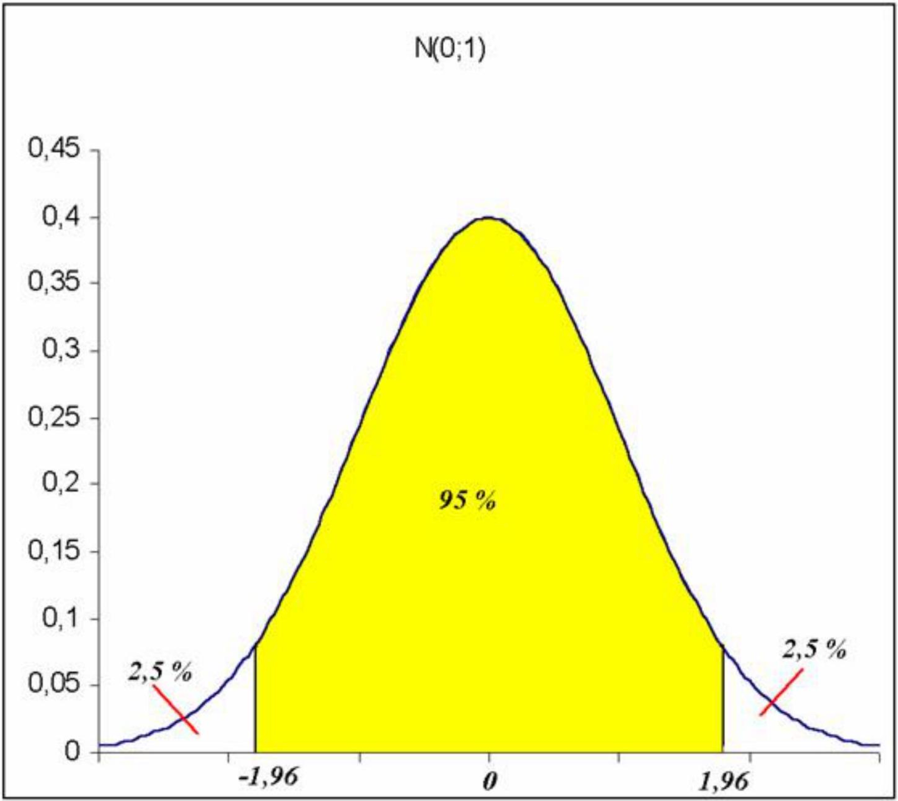

# Estimación por intérvalos


## Motivación de los intervalos de confianza: la estimación puntual casi siempre es falsa

Como se ha visto en el capítulo anterior, un estimador puntual intenta proporcionar la mejor aproximación posible, en uno u otro sentido, al valor verdadero de los parámetros poblacionales que se desean estimar y que en realidad nos son desconocidos.

Sin embargo, ésto debe entenderse en el sentido de que no hemos de creer que el resultado de la estimación puntual ha de coincidir forzosamente con el valor verdadero del parámetro poblacional que queremos estimar. De hecho en muchas ocasiones de lo que podemos estar seguros es de la no-coincidencia. Baste considerar, por ejemplo, una variable Normal y una estimación de su esperanza a través de la media muestral. Como se trata de una variable continua se tiene:

$$
P\left(\bar{X}_{n}=\mu\right)=0.
$$

Esta expresión debe ser interpretada en el sentido de que la coincidencia del estimador con el parámetro verdadero es un suceso de probabilidad cero.

La estimación por intervalos de confianza nos proporciona _un rango de valores entre los que tendremos una cierta certeza o nivel de confianza de que se encuentre nuestro parámetro poblacional desconocido_.

## Definición formal de intervalo de confianza

Dada una muestra aleatoria simple, que podemos suponer se ha obtenido de una variable aleatoria (población) cuya distribución depende de un parámetro $\theta$, diremos que los estadísticos $L_{1}$ y $L_{2}$ son un intervalo de confianza para $\theta$ con nivel de confianza $(1-\alpha) \cdot 100 \%$, si se verifica:

1. $\mathrm{L}_{1}<\mathrm{L}_{2}$ para toda muestra de tamaño $n$.
2. $\mathrm{P}\left(\mathrm{L}_{1} \leq \theta \leq \mathrm{L}_{2}\right)=1-\alpha$.

Hay que destacar que en la segunda condición, en nuestro contexto, el valor del parámetro es fijo, lo que es aleatorio son los estadísticos que delimitan el intervalo.

## Un ejemplo de construcción de un intervalo de confianza

### Planteamiento

Supongamos que tenemos una variable aleatoria que sigue una distribución Normal N $(\mu ; \sigma)$ donde la varianza es un valor fijo conocido $\sigma^{2}=\sigma^2_0$. Nuestro objetivo es, dada una muestra aleatoria simple de tamaño $n$ de la variable obtener un intervalo de confianza con nivel de confianza del $95 \%$ para el parámetro $\mu$ de la distribución.

### Desarrollo de la construcción

Utilizaremos la propiedad de que la media muestral sigue una distribución Normal de parámetros $(\mu ; \sigma/\sqrt{n})$ y, por tanto, si construimos el estadístico

$$
z=\frac{\bar{X}-\mu}{\sigma_{0} / \sqrt{n}}
$$

su distribución es una Normal estándar $\mathrm{N}(0,1)$. 
El hecho de que sea una distribución conocida, que además no depende del parámetro que queremos estimar $\mu$,  nos permite, una vez construida la expresión siguiente

$$
P\left(-z_{\alpha / 2} \leq \frac{\bar{X}-\mu}{\sigma_{0} / \sqrt{n}} \leq z_{\alpha / 2}\right)=1-\alpha
$$

determinar, de manera independiente de $\mu$ el valor $z_{\alpha / 2}$ que delimita una probabilidad del $95 \%$ dentro del intervalo centrado en cero $\left(-z_{\alpha / 2} ; z_{\alpha / 2}\right)$. En este caso, para la distribución $\mathrm{N}(0,1)$, el valor es aproximadamente 1,96.

```{r, out.width="90%", fig.align='center', echo=FALSE}

```


$$
P\left(-1,96 \leq \frac{\bar{X}-\mu}{\sigma_{0} / \sqrt{n}} \leq 1,96\right)=0,95
$$

Sólo nos resta despejar $\mu$ de la expresión anterior para obtener el intervalo definitivo

$$
P\left(\bar{X}-1,96 \frac{\sigma_{0}}{\sqrt{n}} \leq \mu \leq \bar{X}+1,96 \frac{\sigma_{0}}{\sqrt{n}}\right)=0,95
$$

## ¿Por qué hablamos de confianza y no de probabilidad?

Cuando ya hemos calculado el valor de los estadísticos que delimitan un intervalo solemos decir de que dicho intervalo _contiene el parámetro poblacional con un nivel de confianza, por ejemplo del 95 $\%$_. **No decimos** que la probabilidad de que el parámetro esté dentro del intervalo es de un $95 \%$, puesto que esto no tiene sentido, ya que el parámetro es un valor fijo.

Por ejemplo, es correcto decir que el intervalo $(0,80 ; 0,86)$ contiene el parámetro $p$ de una distribución Binomial con una confianza del $95 \%$, pero sería incorrecto decir que la probabilidad de que el parámetro esté dentro del intervalo $(0,80 ; 0,86)$ es del $95 \%$.

En nuestro contexto, el parámetro poblacional es el que es, y no asociamos ninguna probabilidad ni fenómeno aleatorio al respecto. En otros enfoques estadísticos (estadística bayesiana) sí que se considera el parámetro como un valor aleatorio, pero no es nuestro caso.

La confianza del intervalo debe ser entendida como la fracción de intervalos calculados a partir de una gran serie de muestras de tamaño idéntico que contienen el valor verdadero del parámetro poblacional.


:::: {.software}

**Simulación de intérvalos de confianza** 

[https://www.grbio.eu/statmedia/Statmedia_5/](https://www.grbio.eu/statmedia/Statmedia_5/)

::::

El enlace anterior apunta a una aplicación Shiny que permite simular un número determinado de intervalos de confianza para la media de una distribució Normal, basados en muestras del mismo tamaño, y comprobar en cuántas de las simulaciones el intervalo obtenido contiene el verdadero valor de la media poblacional a partir del cual se han simulado las muestras. El porcentaje de aciertos debería acercarse al nivel de confianza con el que se han construido los intervalos.


Manteniendo constante el tamaño muestral, incrementar el nivel de confianza del intervalo implica que la anchura de éste se incrementa. Es totalmente coherente con la lógica, puesto que al exigir mayor seguridad de que el parámetro esté incluido en el intervalo lo que hacemos es alejar los límites inferior y superior para incrementar la certeza de que incluya al parámetro.


Como veremos más adelante, la manera de disminuir la anchura del intervalo y mantener un nivel de confianza deseado es incrementar el tamaño de la muestra utilizada para la construcción del intervalo.

##  Elementos de un intervalo de confianza

A la hora de plantearnos la obtención de un intervalo de confianza hemos de adoptar una serie de decisiones previas.

- La primera y más importante es la elección del parámetro poblacional del cual deseamos obtener la estimación. Generalmente esta elección está relacionada con el tipo de distribución que asumimos para la variable estudiada. De manera usual el parámetro poblacional se corresponde con alguno de los parámetros de las distribuciones, por ejemplo, si deseamos un intervalo de confianza para la probabilidad de un suceso trabajaríamos con el parámetro $p$ de la distribución Binomial. En algún caso, sin embargo, podemos estar interesados en la obtención de un intervalo de confianza para algún parámetro, por ejemplo, la media poblacional, sin hacer ninguna suposición sobre la distribución de la variable. Estaríamos dentro de la denominada estimación no paramétrica.
- Una segunda elección es el nivel de confianza con el que deseamos trabajar. No es una elección sin importancia, puesto que del nivel de confianza dependerá la precisión de la estimación que obtengamos, es decir, la anchura del intervalo. A mayor nivel de confianza exigido, mayor será el radio del intervalo y por tanto menor la precisión en la estimación. Generalmente se trabaja con niveles de confianza del orden del $90 \%$ o $95 \%$.

Podemos comprobarlo con el intervalo de confianza para la media de una distribución Normal:

[^0]- Relacionado con el punto anterior tenemos la elección del tamaño muestral utilizado para la construcción del intervalo. Hemos mencionado que aumentar la confianza significa aumentar la imprecisión de la estimación, sin embargo es posible ajustar una anchura del intervalo determinada para el nivel de confianza deseado jugando con el tamaño muestral utilizado.


### Solución

Manteniendo constante el tamaño muestral, incrementar el nivel de confianza del intervalo implica que la anchura de éste se incrementa. Es totalmente coherente con la lógica, puesto que al exigir más seguridad de que el parámetro esté incluido en el intervalo lo que hacemos es alejar los límites inferior y superior para incrementar la certeza de que incluya al parámetro.

Como veremos más adelante, la manera de disminuir la anchura del intervalo y de mantener un nivel de confianza deseado es incrementar el tamaño de la muestra utilizada para la construcción del intervalo.

### La importancia del tamaño de la muestra

Una de las posibilidades que nos brinda la estimación por intervalos de confianza es fijar a priori la precisión que deseamos en la estimación. La precisión está relacionada de manera inversa con el radio del intervalo. A mayor radio del intervalo menor precisión en la estimación.

La precisión deseada puede obtenerse a través del control del tamaño de la muestra empleada para la construcción del intervalo. Generalmente el investigador fijará el nivel de confianza con el que desea trabajar y la precisión deseada para la estimación.

Con estas premisas y basándose generalmente en la información adicional proporcionada por una muestra piloto obtenida con anterioridad es posible determinar el tamaño muestral mínimo necesario para lograr los objetivos fijados.

Si no se dispone de muestra piloto, es posible utilizar planteamientos alternativos, como los siguientes:

- Expresar la precisión en términos de fracciones de la desviación típica.
- Utilizar las suposiciones más desfavorables posibles.


## Método del pivote

El método del pivote es uno de los principales métodos de construcción de intervalos de confianza. Generaliza la técnica empleada en la construcción del intervalo utilizado como primer ejemplo.

Se basa en la elección de una variable aleatoria que sea función de la muestra y del parámetro a estimar, con la condición de que sea una función continua y monótona del parámetro y que su distribución sea conocida e independiente del parámetro. Llamemos $\varphi(\theta, X)$ a la variable escogida y que recibe el nombre de estadístico pivote.

Bajo estas condiciones, fijado el nivel de confianza $(1-\alpha) \cdot 100 \%$, es posible encontrar los valores $\boldsymbol{a}$ y b tales que

$$
P(a \leq \varphi(\theta, X) \leq b)=1-\alpha
$$

Por las condiciones exigidas sobre el estadístico, será posible despejar $\theta$ y obtener los límites para el intervalo.

$$
P\left(\varphi^{-1}(a, X) \leq \boldsymbol{\theta} \leq \varphi^{-1}(b, X)=1-\alpha\right.
$$

siendo $\mathrm{L}_{1}=\varphi^{-1}(a, X)$ i $\mathrm{L}_{2}=\varphi^{-1}(b, X)$ los límites del intervalo deseado.
Hemos de tener en cuenta que los valores $a$ y $b$ que verifican (1) en general no son únicos. La elección se hace generalmente buscando que el intervalo tenga la máxima precisión, es decir, la longitud mínima. Para distribuciones simétricas y unimodales (Normal o $t$ de Student, por ejemplo) se consigue tomando el intervalo centrado, es decir, dejando una probabilidad de $\alpha / 2$ a cada lado.

## Algunos de los principales estadísticos pivote utilizados en la construcción de intervalos de confianza

| Estadistico pivote | Distribución del estadístico pivote | Observaciones |
| :---: | :---: | :---: |
| a) Poblaciones Normales |  |  |
| $Z=\frac{\bar{X}-\mu}{\sigma / \sqrt{n}}$ | $\mathrm{N}(0,1)$ | Varianza conocida |
| $T=\frac{\bar{X}-\mu}{\hat{S} / \sqrt{n}}$ | t de Student con n-1 grados de libertad | Varianza desconocida |
| $\mathrm{X}^{2}=\frac{(n-1) \hat{S}^{2}}{\sigma^{2}}$ | $x^{2} \text { con } n-1 \text { grados de }$ <br> libertad |  |
| $T=\frac{\left(\bar{X}_{1}-\bar{X}_{2}\right)-\left(\mu_{1}-\mu_{2}\right)}{S_{T} \sqrt{1 / n_{1}+1 / n_{2}}}$ | t de Student con $\mathrm{n}_{1}+\mathrm{n}_{2}-2$ grados de libertad | $\mathrm{S}_{\mathrm{T}}=$ estimación de la $\sigma$ desconocida pero común a ambas poblaciones |
| b) Proporciones |  |  |
| $T=\frac{\hat{p}-p}{\sqrt{\hat{p} \hat{q} / n}}$ | N(0,1) | Distribución asintótica |

## Intervalo de confianza para la media de una distribución Normal

Dada una variable aleatoria con distribución Normal $\mathrm{N}(\mu, \sigma)$, el objetivo es la construcción de un intervalo de confianza para el parámetro $\mu$, basado en una muestra de tamaño $n$ de la variable.

Desde el punto de vista didáctico hemos de considerar dos posibilidades sobre la desviación típica de la variable, que sea conocida o que sea desconocida y tengamos que estimarla a partir de la muestra. El caso de $\sigma$ conocida, ya comentado anteriormente, no pasa de ser un caso académico con poca aplicación en la práctica, sin embargo es útil desde del punto de vista didáctico.

### Caso de varianza conocida

Dada una muestra $X_{1}, \ldots, X_{n}$, el estadístico

$$
z=\frac{\bar{X}-\mu}{\sigma / \sqrt{n}}
$$

se distribuye según una Normal estándar. Por tanto, aplicando el método del pivote podemos construir la expresión

$$
P\left(-z_{c / 2} \leq \frac{\bar{X}-\mu}{\sigma / \sqrt{n}} \leq z_{c / / 2}\right)=1-\alpha
$$

donde $z_{\alpha / 2}$ es el valor de una distribución Normal estándar que deja a su derecha una probabilidad de $\alpha / 2$, de la que se deduce el intervalo de confianza

$$
\bar{X}-z_{\alpha / 2} \frac{\sigma}{\sqrt{n}} \leq \mu \leq \bar{X}+z_{\alpha / 2} \frac{\sigma}{\sqrt{n}}
$$

Puede repasarse la construcción más detallada.

### Caso de varianza desconocida

Dada una muestra $X_{1}, \ldots, X_{n}$, el estadístico

$$
t=\frac{\bar{X}-\mu}{\hat{S} / \sqrt{n}}
$$

se distribuye según una $t$ de Student de $\mathrm{n}-1$ grados de libertad. Por tanto, y siguiendo pasos similares a los del apartado anterior, el intervalo de confianza resultante es

$$
\bar{X}-t_{\alpha / 2} \frac{\hat{S}}{\sqrt{n}} \leq \mu \leq \bar{X}+t_{\alpha / 2} \frac{\hat{S}}{\sqrt{n}}
$$

donde $t_{\alpha / 2}$ es el valor de una distribución t de Student con $\mathrm{n}-1$ grados de libertad que deja a su derecha una probabilidad de $\alpha / 2$.

Con el programa siguiente podemos calcular el intervalo de confianza para la media de una distribución Normal con desviación típica desconocida.

| Pasos que habéis de seguir: |
| :--- |
| 1) Podemos seleccionar la muestra |
| por defecto (992, 995, 998, 1.000 y |
| 1.005) o bien |
| 2) podemos introducir una muestra |
| arbitraria clicando sobre la regla de |
| datos. |
| 3) Podemos modificar los límites de la |
| regla utilizando las barras de |
| desplazamiento correspondientes. |
| 4) Podemos borrar datos entrados en |
| la regla clicando nuevamente sobre |
| ellos. |

### Tamaño de muestra para la media de una distribución Normal

La fórmula para el intervalo de confianza

$$
\bar{X}-t_{\alpha / 2} \frac{\hat{S}}{\sqrt{n}} \leq \mu \leq \bar{X}+t_{\alpha / 2} \frac{\hat{S}}{\sqrt{n}}
$$

nos da la expresión que permite calcular el tamaño muestral para conseguir una precisión determinada:

$$
n=\frac{t_{a / 2}^{2} \hat{S}^{2}}{d^{2}}
$$

donde $d$ es el radio máximo deseado para el intervalo y $t_{\alpha / 2}$ es el valor de una distribución $t$ de Student, con $\mathrm{n}-1$ grados de libertad que deja a su derecha una probabilidad de $\alpha / 2$.

Para aplicar la fórmula es necesario conocer el valor estimado para la desviación típica. Tenemos varias opciones:

- Obtener una muestra piloto de un tamaño arbitrario, no necesariamente grande, y obtenida la estimación de la desviación típica sustituirla en la expresión anterior. El número de grados de libertad de la t de Student debe ser $n_{1}-1$, donde $n_{1}$ es el tamaño muestral de la muestra piloto. Una vez obtenido el intervalo basado en la nueva muestra, se debe comprobar que se ha logrado la precisión deseada para dar por definitivo el resultado.
- Si no es posible la obtención de una muestra piloto, todavía es posible el cálculo del tamaño muestral si definimos el radio del intervalo como una fracción de la desviación típica de la población,

$$
d=K \sigma
$$

y utilizamos como fórmula para calcular el tamaño muestral

$$
n=\frac{z_{a / 2}^{2} \sigma^{2}}{d^{2}}
$$

donde $z_{\alpha / 2}$ es el valor de una distribución Normal estándar que deja a su derecha una probabilidad de $\alpha / 2$.

La fórmula final que resulta es:

$$
n=\frac{z_{\alpha / 2}^{2}}{K^{2}}
$$

- La última posibilidad es sustituir en la expresión (1) el valor de la desviación típica por el valor máximo que se considere que pueda tomar basado en datos bibliográficos previos o en el criterio del investigador.

Podemos utilizar el programa siguiente para calcular, a partir de una muestra piloto, el tamaño muestral necesario para conseguir una precisión determinada al calcular el intervalo de confianza para la media de una distribución Normal.

El programa se puede aplicar de manera
sucesiva hasta corroborar el tamaño adecuado.

## Intervalo de confianza para la varianza de una distribución Normal

Dada una variable aleatoria con distribución Normal $\mathrm{N}(\mu ; \sigma)$, el objetivo es la construcción de un intervalo de confianza para el parámetro $\sigma$, basado en una muestra de tamaño $n$ de la variable.

A partir del estadístico

$$
\mathrm{X}^{2}=\frac{(n-1) \hat{S}^{2}}{\sigma^{2}}
$$

la fórmula para el intervalo de confianza, con nivel de confianza $1-\alpha$ es la siguiente

$$
\frac{(n-1) \hat{S}^{2}}{\chi_{\alpha a / 2}^{2}} \leq \sigma^{2} \leq \frac{(n-1) \hat{S}^{2}}{\chi_{1-\alpha / 2}^{2}}
$$

Donde $\chi_{\alpha / 2}^{2}$ es el valor de una distribución Ji al cuadrado con $n-1$ grados de libertad que deja a su derecha una probabilidad de $\alpha / 2$.

Por ejemplo, dados los datos siguientes:

- Distribución poblacional: Normal
- Tamaño de muestra: 10
- Confianza deseada para el intervalo: $95 \%$
- Varianza muestral corregida: 38,5

Un intervalo de confianza al $95 \%$ para la varianza de la distribución viene dado por:

$$
\frac{9 \cdot 38,5}{19,031} \leq \sigma^{2} \leq \frac{9 \cdot 38,5}{2,699}
$$

que resulta, finalmente

$$
\sigma^{2} \in(18.207 ; 128,381)
$$

## Intervalo de confianza para una proporción

Dada una variable aleatoria con distribución Binomial $\mathrm{B}(n, p)$, el objetivo es la construcción de un intervalo de confianza para el parámetro $p$, basada en una observación de la variable que ha dado como valor $x$. El mismo caso se aplica si estudiamos una Binomial $\mathrm{B}(1, p)$ y consideramos el número de veces que ocurre el suceso que define la variable al repetir el experimento $n$ veces en condiciones de independencia.

Existen dos alternativas a la hora de construir un intervalo de confianza para $p$ :

- Considerar la aproximación asintótica de la distribución Binomial en la distribución Normal.
- Utilizar un método exacto.


### Aproximación asintótica

Tiene la ventaja de la simplicidad en la expresión y en los cálculos, y es la más referenciada en la mayoría de textos de estadística. Se basa en la aproximación

$$
X \sim B(n, p) \rightarrow N(n p, \sqrt{n p q)}
$$

que, trasladada a la frecuencia relativa, resulta

$$
\hat{p}=X / n \rightarrow N(p, \sqrt{p q / n})
$$

Tomando como estadístico pivote

$$
Z=\frac{\hat{p}-p}{\sqrt{\hat{p} \hat{q} / n}}
$$

que sigue una distribución $\mathrm{N}(0,1)$, y añadiendo una corrección por continuidad al pasar de una variable discreta a una continua, se obtiene el intervalo de confianza asintótico:

$$
\hat{p} \pm z_{c / 2 / 2} \sqrt{\frac{\hat{p} \hat{q}}{n}}+\frac{1}{2 n}
$$

donde $z_{\alpha / 2}$ es el valor de una distribución Normal estándar que deja a su derecha una probabilidad de $\alpha / 2$ para un intervalo de confianza de $(1-\alpha) \cdot 100 \%$. Las condiciones generalmente aceptadas para considerar válida la aproximación asintótica anterior son:

$$
n \geq 30 \quad ; \quad n \hat{p} \geq 5 \quad ; \quad n \hat{q} \geq 5
$$

El intervalo obtenido es un intervalo asintótico y por tanto condicionado a la validez de la aproximación utilizada. Una información más general sobre los intervalos de confianza asintóticos puede encontrase aquí.

### Intervalo exacto

Aun cuando las condiciones anteriores no se verifiquen, es posible la construcción de un intervalo exacto, válido siempre pero algo más complicado en los cálculos. Es posible demostrar que un intervalo exacto para el parámetro $p$ viene dado por los valores siguientes:

$$
p_{1}=\frac{X}{(n-X+1) F_{\alpha(2,2(n-X+1), 2 X}+X} ; p_{2}=\frac{(X+1) F_{\alpha(2), 2(X+1), 2(n-X)}}{(n-X)+(X+1) F_{\alpha(2,2,(X+1), 2(n-R)}}
$$

donde $F_{\alpha / 2, a, b}$ es el valor de una distribución $F$ de Fisher-Snedecor con a y b grados de libertad que deja a su derecha una probabilidad de $\alpha / 2$ para un intervalo de confianza de $(1-\alpha) \cdot 100 \%$.

Una justificación de los intervalos de confianza exactos para distribuciones discretas puede encontrarse aquí.

En el programa siguiente puedéis calcular los intervalos de confianza asintótico y, si $n$ es menor de 100, también el exacto para una proporción.

<!--  -->

### Tamaño muestral para una proporción

A partir de la fórmula para el intervalo de confianza

$$
\hat{p} \pm z_{a / 2 / 2} \sqrt{\frac{\hat{p} \hat{q}}{n}}+\frac{1}{2 n}
$$

podemos determinar el tamaño muestral necesario con el fin de que la precisión de la estimación sea la deseada con antelación. La fórmula que resulta es

$$
n=\frac{z_{\alpha / 2}^{2} p q}{d^{2}}
$$

donde $d$ es el radio máximo deseado para el intervalo y $z_{\alpha / 2}$ tiene el significado habitual. Nótese que no hemos tenido en cuenta el último término de la primera expresión.

La aplicación efectiva de la fórmula obtenida requiere el conocimiento de $p$ y de $q=(1-p)$, valores que nos son desconocidos en la práctica. Para solventar este problema tenemos dos alternativas:

- Considerar el caso más desfavorable posible, es decir, aquel que verifique que $p \cdot q$ da el valor máximo posible. Es fácil verificar que esto sucede si $p=0,5$. En este caso el producto es $p \cdot q=$ 0,25.
- Utilizar un valor de referencia obtenido a partir de una muestra piloto o a partir de datos bibliográficos y utilizar el valor compatible con la información más cercano a $p=0,5$.

A partir de la fórmula puede comprobarse que el tamaño muestral requerido, una vez fijada $p$, crece al incrementarse la confianza del intervalo y crece también al incrementarse la precisión (al disminuir el radio).

Con el programa siguiente podemos calcular los tamaños muestrales necesarios para conseguir una precisión determinada bajo diferentes supuestos.

<!--  -->

## Intervalo de confianza para el parámetro de una distribución de Poisson

Dada una variable aleatoria con distribución de Poisson $\mathrm{P}(\lambda)$, el objetivo es la construcción de un intervalo de confianza para el parámetro $\lambda$, basado en una muestra de tamaño $n$ de la variable.

Del mismo modo que para una proporción, existe una solución exacta y una aproximación asintótica al intervalo de confianza para el parámetro $\lambda$.

### Aproximación asintótica

Para valores del parámetro $\lambda$ grandes, la distribución de Poisson puede aproximarse a una distribución Normal según:

$$
P(\lambda) \rightarrow N(\lambda, \sqrt{\lambda})
$$

Dada una muestra de $n$ observaciones independientes distribuidas según una Poisson de parámetro $\lambda, X_{\mathrm{i}}$ $\sim \mathrm{P}(\lambda)$, como la distribución de Poisson es aditiva en $\lambda$ se cumple que $\sum X_{i} \sim P(n \lambda)$. Esta última distribución, si procede, podrá aproximarse a una distribución Normal:

$$
\sum_{i=1}^{n} X_{i} \rightarrow N(n \lambda \sqrt{n \lambda})
$$

Por tanto, es inmediato comprobar que:

$$
P\left(-z_{\alpha / 2} \sqrt{\lambda / n}<\bar{X}-\lambda<z_{\alpha / 2} \sqrt{\lambda / n}\right)=1-\alpha
$$

donde $z_{\alpha / 2}$ es el valor de una distribución Normal standard que deja a su derecha una probabilidad de $\alpha / 2$.

La desigualdad es equivalente a

$$
\bar{X}^{2}-2 \lambda \bar{X}+\lambda^{2}<\frac{\lambda}{n} z_{a / 2}^{2}
$$

El valor de $\lambda$ estará comprendido entre las dos raíces de la ecuación de segundo grado

$$
\lambda^{2}+\lambda\left(-2 \bar{X}-\frac{z_{\alpha z / 2}^{2}}{n}\right)+\bar{X}^{2}=0
$$

Y, finalmente, se obtiene el intervalo de confianza

$$
\lambda \in\left(\bar{X}+\frac{z_{\alpha / 2}^{2}}{2 n} \mp \sqrt{\bar{X} \frac{z_{\alpha / 2}^{2}}{n}+\frac{z_{\alpha / 2}^{4}}{4 n^{2}}}\right)
$$

### Intervalo exacto

Si no son aplicables las condiciones para utilizar la aproximación asintótica puede utilizarse la solución exacta, válida siempre. Puede demostrarse que el intervalo exacto para el parámetro $\lambda$ viene dado por

$$
\lambda_{1}=\frac{1}{2 n} \chi_{1-a / 2}^{2}\left(2 \cdot \sum_{i=1}^{n} X_{i}\right) ; \lambda_{2}=\frac{1}{2 n} \chi_{a / 2}^{2}\left(2 \cdot \sum_{i=1}^{n} X_{i}+2\right)
$$

donde $\chi_{\alpha / 2}^{2}(n)$ es el valor de una distribución Ji al cuadrado con $n$ grados de libertad que deja a su derecha una probabilidad de $\alpha / 2$.

### Tamaño de muestra para el parámetro de una distribución de Poisson

Para determinar el tamaño muestral, se parte de la aproximación

$$
P(\lambda) \rightarrow N(\lambda, \sqrt{\lambda})
$$

La expresión que resulta para el tamaño muestral es:

$$
n=\frac{z_{a / 2}^{2} \lambda}{d^{2}}
$$

Como suele ocurrir, la fórmula depende del parámetro desconocido y las alternativas vuelven a ser:

- Utilizar una muestra piloto o datos externos para estimar $\lambda$ y tomar el valor máximo que se considere que puede valer.
- Conformarse con una precisión del tipo $d^{2}=K^{2} \lambda$, de manera que la fórmula queda reducida a

$$
n=z_{a / 2}^{2} / K^{2}
$$

## Intervalo de confianza para la diferencia de medias de distribuciones normales independientes.

### Varianza común

#### Caso de varianza desconocida y común

Supondremos la existencia de dos poblaciones sobre las que una variable determinada sigue una distribución Normal con idéntica varianza en las dos. Sobre la población 1, la variable sigue una distribución $\mathrm{N}\left(\mu_{1}, \sigma\right)$ y, sobre la población 2 , sigue una distribución $N\left(\mu_{2}, \sigma\right)$. Igualmente supondremos que disponemos de dos muestras aleatorias independientes, una para cada población, de tamaños muestrales $n_{1}$ y $n_{2}$ respectivamente.

El objetivo es construir un intervalo de confianza, con nivel de confianza ( $1-\alpha$ ) $100 \%$, para la diferencia de medias

$$
\mu_{1}-\mu_{2}
$$

El método se basa en la construcción de una nueva variable $D$, definida como la diferencia de las medias muestrales para cada población

$$
D=\bar{X}_{1}-\bar{X}_{2}
$$

Esta variable, bajo la hipótesis de independencia de las muestras, sigue una distribución Normal de esperanza

$$
\mu_{1}-\mu_{2}
$$

y de varianza

$$
\operatorname{Var}(D)=\sigma^{2}\left(\frac{1}{n_{1}}+\frac{1}{n_{2}}\right)
$$

La estimación conjunta, a partir de las dos muestras, de la varianza común viene dada por la expresión

$$
\hat{S}_{T}^{2}=\frac{\left(n_{1}-1\right) \cdot \hat{S}_{1}^{2}+\left(n_{2}-1\right) \cdot \hat{S}_{2}^{2}}{n_{1}+n_{2}-2}
$$

$y$, utilizando la propiedad de que la variable

$$
\frac{\left(n_{1}+n_{2}-2\right) \hat{S}_{T}^{2}}{\sigma^{2}}
$$

sigue una distribución $\chi^{2}$ con $\mathrm{n}_{1}+\mathrm{n}_{2}-2$ grados de libertad, podemos construir un estadístico pivote que siga una distribución $t$ de Student y que nos proporciona la fórmula siguiente para el intervalo de
confianza para la diferencia de medias:

$$
\left(\bar{X}_{1}-\bar{X}_{2}\right)-t_{a / 2} \cdot \hat{S}_{T} \cdot \sqrt{\frac{1}{n_{1}}+\frac{1}{n_{2}}} \leq \mu_{1}-\mu_{2} \leq\left(\bar{X}_{1}-\bar{X}_{2}\right)+t_{a k 2} \cdot \hat{S}_{T} \cdot \sqrt{\frac{1}{n_{1}}+\frac{1}{n_{2}}}
$$

donde $t_{\alpha / 2}$ es el valor de una distribución $t$ de Student con $\mathrm{n}_{1}+\mathrm{n}_{2}-2$ grados de libertad que deja a su derecha una probabilidad de $\alpha / 2$.

## Intervalo de confianza para la diferencia de medias de distribuciones normales independientes.

### Varianza diferente

### Caso de varianzas desconocidas y diferentes

Cuando tenemos razones para suponer que la varianza no es común, no podemos utilizar el estadístico anterior. Hemos de destacar que, en esta situación, no existe un método exacto que permita obtener el intervalo de confianza deseado. Lo más que tenemos son aproximaciones a la solución. Un intervalo aproximado con nivel de confianza $(1-\alpha) \cdot 100 \%$ es

$$
\left(\bar{X}_{1}-\bar{X}_{2}\right)-t_{\alpha / 2} \cdot \sqrt{\frac{\hat{S_{1}}}{n_{1}}+\frac{\hat{S}_{2}}{n_{2}}} \leq \mu_{1}-\mu_{2} \leq\left(\bar{X}_{1}-\bar{X}_{2}\right)+t_{\alpha / 2} \cdot \sqrt{\frac{\hat{S_{1}}}{n_{1}}+\frac{\hat{S}_{2}}{n_{2}}},
$$

donde $\hat{S}_{1}$ y $\hat{S}_{2}$ son las varianzas muestrales corregidas para cada población y donde $t_{\alpha / 2}$ es el valor de una distribución $t$ de Student con $g$ grados de libertad, donde

$$
g=\frac{\left(\hat{S}_{1}^{2} / n_{1}+\hat{S}_{2}^{2} / n_{2}\right)^{2}}{\frac{\left(\hat{S}_{1}^{2} / n_{1}\right)^{2}}{n_{1}+1}+\frac{\left(\hat{S}_{2}^{2} / n_{2}\right)^{2}}{n_{2}+1}}-2
$$

Si los grados de libertad resultantes son decimales, puede optarse por hacer una interpolación entre los dos valores enteros más cercanos o bien por tomar el valor más desfavorable, aquel que suponga un radio mayor para el intervalo de confianza y que coincide con el redondeo a la baja de los grados de libertad.

Es, por tanto, muy importante, antes de proceder a la obtención del intervalo de confianza para la diferencia de medias, verificar si la suposición de homogeneidad de varianzas es razonable o no. Una manera de verificarlo consiste en la construcción del intervalo para el cociente de varianzas, tal como se explica más adelante, y comprobar si en dicho intervalo está incluido el valor 1. La inclusión de la unidad dentro del intervalo resultante, la debemos interpretar en el sentido de que la muestra no proporciona evidencia suficiente para afirmar que las varianzas son diferentes y, por tanto, no es incorrecta la utilización del intervalo para varianza común. De manera análoga, el intervalo de confianza para la diferencia de medias nos puede servir para verificar la suposición de que las medias son iguales o diferentes; en este caso, si el valor 0 está incluido en el intervalo, la conclusión es que la muestra no proporciona evidencia suficiente para afirmar que las medias son diferentes.

Nota importante: El párrafo anterior nos introduce en la posibilidad de utilizar intervalos de confianza para verificar o rechazar ciertas suposiciones sobre el parámetro o los parámetros de las distribuciones. La técnica específica para la verificación de dichas suposiciones o hipótesis a partir de muestras aleatorias se verá en los temas siguientes, donde se introduce el concepto de contraste de hipótesis, sin embargo no podemos dejar de mencionar aquí que los intervalos de confianza nos pueden proporcionar una técnica alternativa o complementaria para la resolución de contrastes.

## Intervalo de confianza para el cociente de varianzas de distribuciones normales independientes

Supondremos la existencia de dos poblaciones sobre las que una determinada variable sigue una distribución Normal. Sobre la población 1 la variable sigue una distribución $N\left(\mu_{1}, \sigma_{1}\right)$ y sobre la población 2 sigue una distribución $\mathrm{N}\left(\mu_{2}, \sigma_{2}\right)$. Igualmente supondremos que disponemos de dos muestras aleatorias independientes, una para cada población, de tamaños muestrales $n_{1}$ y $n_{2}$ respectivamente.

El objetivo es construir un intervalo de confianza, con nivel de confianza ( $1-\alpha$ ) • $100 \%$, para el cociente de varianzas

$$
\frac{\sigma_{1}^{2}}{\sigma_{2}^{2}}
$$

El estadístico pivote utilizado es

$$
F=\frac{\hat{S}_{1}^{2} / \sigma_{1}^{2}}{\hat{S}_{2}^{2} / \sigma_{2}^{2}}
$$

que sigue una distribución $F$ de Fisher con $n_{1}-1$ y $n_{2}-1$ grados de libertad.
El intervalo de confianza que resulta es

$$
\frac{\hat{S}_{1}^{2} / \hat{S}_{2}^{2}}{F_{\alpha / 2}} \leq \frac{\sigma_{1}^{2}}{\sigma_{2}^{2}} \leq \frac{\hat{S}_{1}^{2} / \hat{S}_{2}^{2}}{F_{1-\alpha / 2}}
$$

donde $F_{\alpha / 2}$ es el valor de una distribución $F$ de Fisher-Snedecor con $n_{1}-1$ y $n_{2}-1$ grados de libertad que deja a su derecha una probabilidad de $\alpha / 2$.

## Complementos

###  Interpretación geométrica de los intervalos de confianza

Es posible tener una visión gráfica de los intervalos de confianza, los límites del intervalo pueden ser representados por curvas en el plano formado por el parámetro que queremos estimar y el estadístico utilizado para construir el pivote. Esta visión nos puede ayudar en la interpretación y la comprensión de los intervalos o de sus propiedades.

Por ejemplo, el intervalo del $95 \%$ para la esperanza de una distribución Normal con varianza conocida y para una muestra de tamaño $n=9$, de fórmula

$$
\bar{X}-z_{\alpha / 2} \frac{\sigma}{\sqrt{n}} \leq \mu \leq \bar{X}+z_{\alpha / 2} \frac{\sigma}{\sqrt{n}}
$$

puede representarse por medio de la figura siguiente:

<!--  -->

El eje horizontal representa la media muestral y el eje vertical el valor del intervalo para el parámetro $\mu$. Como puede observarse los límites son líneas rectas y la anchura del intervalo es la misma para cualquier valor de la media.

Veamos ahora la representación gráfica del intervalo para una proporción. La fórmula es

$$
\hat{p} \pm z_{c / 2 / 2} \sqrt{\frac{\hat{p} \hat{q}}{n}}+\frac{1}{2 n}
$$

y, para una muestra de tamaño $n=9$ y un intervalo de confianza del $95 \%$, la gráfica resultante es:

<!--  -->

El eje horizontal es la frecuencia relativa observada y el eje vertical el intervalo de confianza para la proporción. Podemos notar que la anchura del intervalo varía y que, en el caso más desfavorable, la máxima amplitud se da para una frecuencia observada de 0,5.

###  Intervalos para muestras grandes

Bajo ciertas condiciones de regularidad, es posible construir intervalos de confianza asintóticos de una manera bastante general.

Si suponemos que un parámetro $\theta$ tiene una estimación máximo verosímil $\theta^{*}$, la distribución asintótica del estimador, bajo condiciones generales de regularidad, es Normal, de media el valor verdadero del parámetro $\theta$ y varianza igual a la cota de Cramér-Rao $\sigma^{2}\left(\theta^{*}\right)$.

$$
1 / \sqrt{n \mathrm{E}\left(\frac{\partial}{\partial \theta} \ln f(X, \theta)\right)^{2}}=\sigma\left(\theta^{*}\right)
$$

Bajo las suposiciones anteriores, es posible construir un intervalo de confianza asintótico y con nivel de confianza $(1-\alpha) \cdot 100 \%$ a partir de

$$
P\left(-z_{\alpha / 2} \leq \frac{\theta^{*}-\theta}{1 / \sqrt{n \mathrm{E}\left(\frac{\partial}{\partial \theta} \ln f(X, \theta)\right)^{2}}} \leq z_{\alpha / 2}\right)=1-\alpha
$$

donde los valores de $z_{\alpha / 2}$ se calculan a partir de la distribución $N(0,1)$ de forma que $P\left(|Z|>z_{\alpha / 2}\right)=\alpha$.
Es decir, se utiliza como estadístico pivote

| Estadístico pivote | Distribución del estadístico pivote | Observaciones |
| :---: | :---: | :---: |
| $Z=\frac{\theta^{*}-\theta}{\sigma\left(\theta^{*}\right)}$ | N( 0,1 ) | Distribución asintótica, $\theta^{*}$ es la estimación máximo verosimil del parámetro y $\sigma\left(\theta^{*}\right)$ es la cota de Crámer-Rao |

El intervalo de confianza aproximado que resulta es:

$$
\theta^{*}-z_{a / 2} \sigma\left(\theta^{*}\right) \leq \theta \leq \theta^{*}+z_{a / 2} \sigma\left(\theta^{*}\right)
$$

###  Intervalos exactos para distribuciones discretas

El procedimiento que permite obtener los intervalos exactos para los parámetros de las distribuciones discretas, por ejemplo los parámetros $\lambda$ de la distribución de Poisson o $p$ de la Binomial, se explica a continuación.

Consideramos que la variable aleatoria discreta tiene por recorrido $\{0,1,2, \ldots\}$ y depende de un parámetro desconocido $\theta$. Si suponemos que se ha obtenido una muestra de tamaño 1 y de valor $k$ (donde $k$ puede ser, por ejemplo, la frecuencia con que se ha presentado un suceso en $n$ experiencias o la suma de $n$ observaciones distribuidas según una distribución de Poisson), se trata de resolver las ecuaciones siguientes:

$$
\begin{aligned}
& \sum_{\substack{i=k \\
k}}^{\infty} P(x=i / \theta)=\alpha / 2 \\
& \sum_{i=0}^{k} P(x=i / \theta)=\alpha / 2
\end{aligned}
$$

Las soluciones $\theta_{1}$ y $\theta_{2}$ constituyen el intervalo de confianza de nivel de confianza $(1-\alpha) \cdot 100 \%$ buscado.

Veamos un ejemplo:
Supongamos que tenemos una variable Binomial con $n=4$ y que una observación nos ha dado $x=2$. ¿Cuál es el intervalo de confianza del $95 \%$ para el parámetro $p$ ?

Hemos de resolver las ecuaciones siguientes:

$$
\begin{aligned}
& P(X=0)+P(X=1)+P(X=2)=\binom{4}{0}(1-p)^{4}+\binom{4}{1} p(1-p)^{3}+\binom{4}{2} p^{2}(1-p)^{2}=0,025 \\
& P(X=2)+P(X=3)+P(X=4)=\binom{4}{2} p^{2}(1-p)^{2}+\binom{4}{3} p^{3}(1-p)+\binom{4}{4} p^{4}=0,025
\end{aligned}
$$

Utilizando un programa de cálculo numérico (el Mathematica, por ejemplo) obtenemos como soluciones significativas $p_{1}=0,932414$, para la primera, y $p_{2}=0,067586$, para la segunda; quedando finalmente el intervalo ( 0,$067586 ; 0,932414$ ).

Podéis comprobar el resultado aquí, tomando $n=4$ y $x=2$.

En la bibliografia existen numerosas tablas para el cálculo de dichos intervalos, pero también son aplicables las fórmulas presentadas para la Binomial y la Poisson.

###  Una aproximación diferente para la distribución de Poisson

Hemos visto con anterioridad la construcción del intervalo de confianza para el parámetro $\lambda$ de una distribución de Poisson. Los cálculos y la fórmula del intervalo eran algo complejos, sin embargo, si en lugar de trabajar directamente con la variable, efectuamos una transformación previa, en particular, si trabajamos con la raíz cuadrada de la variable, el problema puede simplificarse notablemente.

Puede demostrarse que

$$
X \rightarrow P(\lambda) \Rightarrow \sqrt{X} \rightarrow N(\sqrt{\lambda} ; 1 / 2)
$$

La transformación de la raíz cuadrada es una transformación estabilizadora de la varianza, la ventaja es que la varianza resultante $(0,25)$ no depende del parámetro $\lambda$ que se ha de estimar, facilitando la obtención de resultados. En nuestro caso,

$$
\sqrt{\sum_{i=1}^{n} X_{i}} \rightarrow N\left(\sqrt{n \lambda_{3}} 1 / 2\right)
$$

y se obtiene fácilmente el intervalo de confianza

$$
\sqrt{\sum_{i=1}^{n} X_{i}}-\frac{z_{\alpha / 2}}{2}<\sqrt{n \lambda}<\sqrt{\sum_{i=1}^{n} X_{i}}+\frac{z_{\alpha / 2}}{2}
$$

donde $z_{\alpha}$ es el valor de una distribución Normal estándar que deja a su derecha una probabilidad de $\alpha$.
Y, si despejamos,

$$
\lambda \in \frac{1}{n}\left(\frac{z_{\alpha / 2}}{2} \pm \sqrt{\sum_{i=1}^{n} X_{i}}\right)^{2}
$$

Comparad la fórmula obtenida con la desarrollada en el caso de no utilizar la transformación.

### Aproximación mediante Chébishev

El teorema de Chébishev nos proporciona una aproximación al problema de construcción de intervalos de confianza para los valores de una variable aleatoria independientemente de su distribución. No es por tanto una estimación paramétrica a través de intervalos de confianza, sino únicamente una manera de acotar la probabilidad de una variable aleatoria alrededor de su esperanza.

La ventaja del enfoque basado en Chébishev es que no es necesaria ninguna suposición sobre la distribución de la variable, la única condición es la existencia de esperanza y de varianza finita para la variable aleatoria.

El inconveniente es la falta de precisión de la estimación, puesto que trabajamos con una cota superior para la probabilidad de desviación de una variable aleatoria respecto a su esperanza.

La fórmula utilizada es

$$
P(|X-E(X)| \geq h) \leq \frac{\operatorname{Var}(X)}{h^{2}}
$$

donde $h>0$.
Una vez que se dispone de los valores de la esperanza y de la varianza de la variable, es posible fijar la probabilidad deseada y despejar el valor de $h$ que nos proporciona el radio del intervalo centrado en la esperanza.

$$
h^{2}=\frac{\operatorname{Var}(X)}{1-\text { Probabilidad deseada del intervalo }}
$$

El resultado final se interpreta en el sentido de que la probabilidad de que la variable se encuentre dentro del intervalo construido es mayor o igual que la probabilidad fijada.

<!--  -->


<!-- [^0]:    Pasos que habéis de seguir: -->

<!--     1) Obtenemos los datos de la muestra por defecto (992, 995, 998, 1.000 y 1.005). -->
<!--     2) Seleccionamos un nivel de confianza del 70 \% y ejecutamos la obtención del intervalo. -->
<!--     3) Modificamos los niveles de confianza y obtenemos los intervalos correspondientes. ¿Qué observamos? -->

<!--     Solución -->
<!--     4) Podemos borrar los datos e introducir nuestra propia muestra clicando sobre la regla de datos. -->

