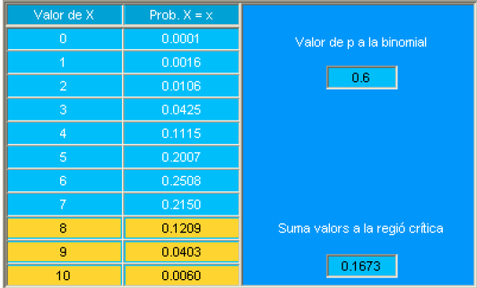
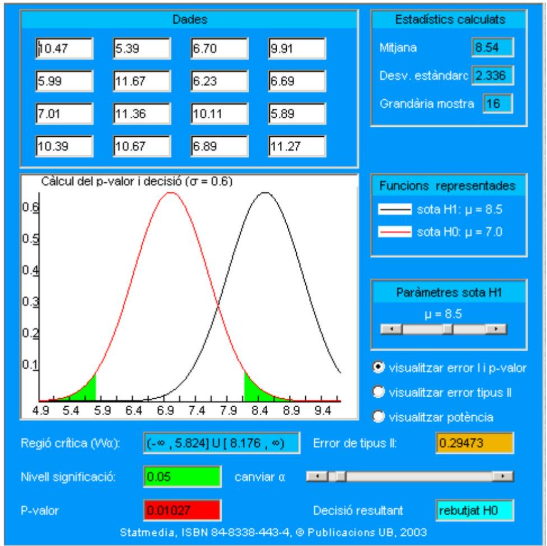

# Pruebas de hipótesis

## Introducción

### De las hipótesis científicas a las hipótesis estadísticas

Antes de introducir los conceptos asociados al contraste estadístico de hipótesis, es conveniente situar este tema en el contexto más general de la *confirmación de hipótesis*, materia que la filosofía de la ciencia estudia en profundidad. Así pues, en este punto solo se plantean consideraciones generales, dejando para los siguientes apartados cómo aborda la Estadística este tema.

Una cuestión esencial en cualquier rama de la ciencia -básica o aplicada- es cómo verificar hipótesis sobre un determinado fenómeno real. Muchas veces, cuando se expone este tema al estudiante durante las primeras etapas de su formación científica, el llamado método de razonamiento científico se simplifica en exceso, presentando la verificación de hipótesis en términos absolutos. En este esquema simplificado del método científico se expone cómo teorizar sobre un determinado aspecto de la realidad más o menos de la siguiente forma:

a)  se formula una teoría (o una hipótesis, o una ley, ...) sobre el fenómeno de estudio\
b)  se diseña un experimento para tratar de corroborar dicha teoría\
c)  si los resultados del experimento concuerdan con la teoría, ésta se da provisionalmente por válida\
d)  si el experimento contradice la teoría, se vuelve al apartado a), se modifica la ley o se elabora una nueva, de modo que se ajuste a la realidad experimental.\
e)  cualquier teoría relacionada con aspectos de la realidad es siempre provisional, pendiente de ser revisada al entrar en conflicto con resultados de experimentos posteriores.

Esta forma de proceder -como veremos, excesivamente simplista- se basa en el hecho de asumir que en cualquier experimento se obtendrán resultados que serán *o bien totalmente contradictorios* con la teoría (y por tanto habrá que abandonarla inmediatamente) *o bien concordantes* con la teoría (y por tanto resulta razonable mantenerla).

Antes se ha calificado este método de validación como absoluto: si obviamos el posible error experimental, la decisión que se tome no conllevará ningún error, ya que basta con verificar los resultados del experimento para aceptar o rechazar la teoría.

Debe quedar claro al lector que el esquema anterior *no es el de un contraste estadístico*, y de hecho el desarrollo de este tema se encargará de revisarlo. En los próximos apartados se expondrá, para empezar, una primera idea fundamental en Estadística: cuando se introduce un modelo de probabilidad para explicar un fenómeno, emerge inevitablemente un error ya en la misma toma de decisión. En otras palabras, el esquema anterior debe revisarse en los puntos c) y d).

Una vez se han expuesto estas cuestiones fundamentales en los primeros puntos del capítulo, entraremos en el núcleo de este tema que consiste en el desarrollo ya puramente técnico del contraste estadístico de hipótesis.

### Del lenguaje natural a la hipótesis estadística

Es necesario considerar, antes de afrontar la validación estadística de una hipótesis, cómo se plantea ésta en términos estadísticos, ya que su formulación exige una traducción del lenguaje natural.

Conviene pues recordar que una hipótesis sobre un determinado fenómeno se formula en lenguaje natural como una *proposición sobre la realidad*. Por ejemplo, si se está estudiando determinada especie de aves, una posible hipótesis es que la proporción de machos es idéntica a la de hembras. Un segundo ejemplo nos lo proporciona el estudio del metabolismo humano en donde se propone como hipótesis que la concentración de cierta hormona se mantiene constante cuando se suministra un fármaco anabolizante.

Las hipótesis planteadas en los ejemplos, similares a otras que se trataran en este capítulo se denominan genéricamente *hipótesis paramétricas* porque hacen referencia a características de la población que pueden relacionarse directamente con los parámetros de un modelo probabilístico que la describe. Por ejemplo, si utilizamos una distribución binomial para representar el número de aves hembra en un nido, la proporción de hembras se corresponde con el parámetro $p$ de dicha distribución.

Así pues, el primer esfuerzo que debe realizar el experimentador es trasladar sus hipótesis, que generalmente expresa en lenguaje natural, a afirmaciones (proposiciones) sobre los parámetros de la distribución que considere más apropiada para describir el fenómeno que estudia.

En ocasiones, sin embargo, la selección misma del modelo probabilístico puede ser el problema. En estos casos la hipótesis se formulará en erminos de la distribución en vez de los parámetros de la misma. Por ejemplo al hablar de la concentración de la hormona durante la metabolizacioón de un fármaco el investigador puede desear decidir si es mas adecuada una distribución normal o una distribución gamma para representar dicha concentración. En este caso hablaríamos de *hipótesis no paramétricas*, que se discutiran más adelante en el curso.

En los casos prácticos siguientes, cuya solución completa se verá a lo largo del capítulo, se presentan dos situaciones diferentes.

### Caso 1: Presentación

Dos conocidos ornitólogos, especialistas en aves autóctonas del Amazonas Central, discrepan sobre la interpretación de los datos de una nueva especie de cacatúa que ha reseñado uno de ellos. La discusión la centraremos aquí en una de las variables del estudio: la proporción de hembras y machos en los nidos. Es importante precisar que estas cacatúas se caracterizan por incubar un solo huevo por nido.

El Dr. da Souza Faria ha censado diez nidos, cuyos datos se detallarán después. Según su experiencia, esta especie tiene una gran semejanza con otra especie mejor estudiada, con una proporción idéntica de machos y hembras. Apoyado en los datos obtenidos, concluye que la nueva especie también tiene la misma proporción de individuos de cada sexo.

El Dr. Calves discrepa de esta apreciación y sostiene que la proporción debe ser de seis hembras por cada 4 machos.

### Caso 1: Modelo de probabilidad

El Dr. da Souza Faria ha contado en 10 nidos el número de hembras (complementariamente, el de machos). La variable es, por tanto, discreta y su soporte es el conjunto $\{0,1,2,3,4,5,6,7,8,9,10\}$.

Si asumimos que el posible nacimiento de hembras es independiente entre nidos, y definimos:

$$
X=\text { número de hembras en un total de } 10 \text { nidos. }
$$

la distribución de $X$ es una distribución binomial, de parámetros $n=10$ y $p$ desconocida.

$$
f(k)=p(X=k)=\binom{10}{k} p^{k}(1-p)^{10-k}
$$

el único parámetro desconocido es la proporción $\boldsymbol{p}$ de hembras. Las hipótesis estadísticas se referirán solo a $p$.

### Caso 2: Presentación

En el mundo del deporte profesional se controlan con mucha precisión algunos metabolitos que aparecen en bajas concentraciones en condiciones normales. Este es el caso de la statdrolona[^09-pruebashipotesis-1], que en individuos normales presenta una concentración media de 7.0 nanogramos por ml de orina. Este valor se ha establecido mediante una muestra muy grande de deportistas después de años de análisis antes, durante y después de competiciones. Asimismo, se ha descrito que la desviación estándar es de $\mathbf{2 . 4 ~ n g} / \mathbf{m l}$. Estos dos valores poblacionales sirven como justificación médica a las autoridades deportivas para declarar cuándo la tasa de statdrolona se asocia a un presunto dopaje.

[^09-pruebashipotesis-1]: La statdrolona no es ninguna hormona, aquí se ha adaptado la información de hormonas reales.

No obstante, un estudio reciente encargado por la asociación de deportistas ADG a un prestigioso departamento universitario de fisiología sostiene que, cuando se mide la concentración de statdrolona en individuos no dopados con cierto tipo de alimentos sobreabundantes en su dieta (queso parmesano, por ejemplo), el valor de la media poblacional es del orden de $\mathbf{1 . 5}$ unidades mayor. En cambio, la desviación estándar poblacional se mantiene en el valor $2,4 \mathrm{ng} / \mathrm{ml}$, es decir, equivalente a la normal. Si esta hipótesis fuera cierta, permitiría explicar algunos de los falsos positivos detectados en los últimos tiempos. Como prueba experimental aportan una serie de datos sobre 16 deportistas que se detallarán más adelante.

### Caso 2: Modelo de probabilidad

El análisis de la concentración de statdrolona se mide en términos de nanogramos por $\mathrm{mil} \cdot$ litro, por lo tanto, parece razonable considerarla como una variable continua. El conjunto de resultados posibles será un subconjunto de los reales.

Como muchas otras variables antropométricas, la concentración se puede asociar a la distribución Normal. Se puede justificar la adopción de este modelo de acuerdo con el teorema central del límite.

Según las autoridades deportivas, los valores en un deportista no dopado deben corresponder a una media de $7.0 \mathrm{ng} / \mathrm{ml}$, mientras que para ADG la media puede ser mayor en algunas circunstancias. En cualquier caso, la variable:

$$
X=\text { concentración de statdrolona en un deportista. }
$$

se aceptará que tiene distribución Normal. Así, la discusión se centrará solo en el parámetro $\mu$ desconocido, mientras que la desviación estándar se tomará, para simplificar la explicación, como $\sigma=2.4$ (conocida), aunque se sabe que es más realista seleccionarla como desconocida (véase más adelante en el curso, o los temas anteriores de intérvalos de confianza y distribuciones en el muestreo).

La fórmula de la densidad Normal:

$$
f_{X}(x)=\frac{1}{2.4 \sqrt{2 \pi}} \exp \left(-\frac{(x-\mu)^{2}}{2 \times 2.4^{2}}\right)
$$

indica para este caso que el único parámetro desconocido es la media de la población $\boldsymbol{\mu}$, a la que se referirán las hipótesis estadísticas.

Ahora bien, también resulta importante describir la densidad de la media de los dieciséis deportistas, ya que jugará un papel importante en la construcción del test. Si aceptamos la distribución $\mathrm{N}(\mu, 2.4)$ para un deportista, y *consideramos que el muestreo es aleatorio simple*, entonces:

$$
\bar{X}_{16}=\text { media concentración statdrolona en } 16 \text { deportistas }
$$

que tendrá una densidad de la forma:

$$
\bar{X}_{16} \approx N(\mu, 2.4 / \sqrt{16})
$$

Simplificando 2.4 por la raíz cuadrada de 16 resulta 0.6 , así pues:

$$
f_{\bar{X}_{16}}(x)=\frac{1}{0.6 \sqrt{2 \pi}} \exp \left(-\frac{(x-\mu)^{2}}{2 \times 0.6^{2}}\right)
$$

Una expresión más general para todo $n$ sería:

$$
\bar{X}_{n} \approx N(\mu, 2.4 / \sqrt{n})
$$

La densidad para todo $n$ es:

$$
f_{\bar{X}_{n}}(x)=\frac{\sqrt{n}}{2.4 \sqrt{2 \pi}} \exp \left(-\frac{n \times(x-\mu)^{2}}{2 \times 2.4^{2}}\right)
$$

Y una expresión para todo $n$ y cualquier varianza es:

$$
f_{\bar{X}_{n}}(x)=\frac{\sqrt{n}}{\sigma \sqrt{2 \pi}} \exp \left(-\frac{n \times(x-\mu)^{2}}{2 \times \sigma^{2}}\right)
$$

## Las hipótesis del contraste de hipótesis

La teoría del contraste de hipótesis es una de las partes más discutidas de la estadística, por motivos que esperamos iran quedando claros a medida que se avanza en este tema y los siguientes.

De hecho esta teoría ya nació entre la polémica porque, prácticamente desee sus comienzos hubieron dos escuelas de pensamiento enfrentadas. La escuela de Ronald A. Fisher, genético y estadístic británico y la de los matemáticos Polacos y Americanos Neymann y Pearson.

Con el fin de evitar que la polémica confunda el aprendizaje, al menos en esta fae inicial, lo que se presenta a continuación se basa principalmente en las ideas de Neymann y Pearson que, con la finalidad de encontrar el mejor contraste posible para un problema dado, plantearon los contrastes de hipótesis estadísticos como una *decisión entre dos hipótesis*: la **hipótesis nula** y la **hipótesis alternativa**.

-   La *hipótesis nula* consiste, en general, en una afirmación sobre (alguna característica de) la población de origen de la muestra. Usualmente representa algún tipo de simplificación (por ejemplo: el tratamiento administrado NO tiene efecto por lo que no hay diferencia entre antes y después de recibirlo. La hipótesis nula se designa con el símbolo $\mathbf{H}_{\mathbf{0}}$.

-   La *hipótesis alternativa* es igualmente una afirmación sobre la población de origen, y, amenudo, aunque no siempre, consiste simplemente en negar la afirmación de $\mathrm{H}_{0}$. La hipótesis alternativa se designa con el símbolo $\mathbf{H}_{1}$.

En el estudio del contraste de hipótesis se suele partir del caso, que de tan sencillo resulta poco realista, en el cual las dos hipótesis hacen referencia a un único valor del parámetro. En esta situación general, las hipótesis se refieren a un parámetro $\theta$ (theta). La formulación es:

$$
\begin{aligned}
& \mathrm{H}_{0}: \theta=\theta_{0} \\
& \mathrm{H}_{1}: \theta=\theta_{1}
\end{aligned}
$$ De hecho, sería mucho más realista plantear que la alternativa a un valor $\theta_0$ sea que el parámetro toma valores superiores ($\mathrm{H}_{1}: \theta \geq \theta_{0}$), inferiores ($\mathrm{H}_{1}: \theta \leq \theta_{0}$) o distintos ($\mathrm{H}_{1}: \theta \neq \theta_{0}$)a $\theta_0$. En la práctica este será el planteamiento de los tests que se presentará más adelante.

En la teoría del contraste de hipótesis este tipo de planteamiento se conoce como contraste de hipótesis *simple contra simple*. Así pues, una hipótesis simple postula que el parámetro $\theta$ solo puede tomar un valor, o, más técnicamente, que el conjunto de parámetros de una hipótesis simple consiste en un solo punto.

### Caso 1: Hipótesis para dirimir la controversia sobre el número de hembras

El Dr. da Souza Faria postula la misma proporción para machos y hembras. En términos de la proporción de la variable $X$ (n.º de hembras en 10 nidos) esto equivale a la hipótesis de que la proporción (en la población) es $\mathbf{0 . 5}$.

En cambio, según el Dr. Calves la proporción es 6:4 a favor de las hembras, y por lo tanto equivale a la hipótesis de que el parámetro $p$ en la variable Binomial es 0.6.

Así pues, si $X$ es el número de hembras en 10 nidos, y $p$ es la proporción de hembras, la forma final del contraste es:

$$
\begin{aligned}
& \mathrm{H}_{0}: \mathrm{p}=0.5 \\
& \mathrm{H}_{1}: \mathrm{p}=0.6
\end{aligned}
$$

Respecto a los datos obtenidos por da Souza son:

| Nido | Polluelo | Nido | Polluelo |
|:-----|:---------|:-----|:---------|
| 1    | hembra   | 6    | macho    |
| 2    | macho    | 7    | hembra   |
| 3    | hembra   | 8    | hembra   |
| 4    | hembra   | 9    | macho    |
| 5    | macho    | 10   | hembra   |

En resumen, ha observado que en $\mathbf{6}$ de los nidos hay una hembra.

### Caso 2: Hipótesis a contrastar en el problema de la tasa de statdrolona

Las autoridades deportivas postulan una media de $7.0 \mathrm{ng} / \mathrm{ml}$, mientras que ADG indica una media de $8.5 \mathrm{ng} / \mathrm{ml}$ para los individuos sometidos a este tipo de dieta. Por tanto, en síntesis el contraste consistirá en:

$$
\begin{aligned}
& \mathrm{H}_{0}: \mu=7,0 \\
& \mathrm{H}_{1}: \mu=8,5
\end{aligned}
$$

tanto para $\mathrm{H}_{0}$ como para $\mathrm{H}_{1}$ el modelo contempla $\sigma=2,4$.\
Los datos del estudio que ha obtenido la asociación ADG, y que según ellos respaldaban su tesis, han sido los siguientes:

| Individuo | Concentración | Individuo | Concentración |
|:---------:|:-------------:|:---------:|:-------------:|
|     1     |     10.47     |     9     |     7.01      |
|     2     |     5.39      |    10     |     11.36     |
|     3     |     6.70      |    11     |     10.11     |
|     4     |     9.91      |    12     |     5.89      |
|     5     |     5.99      |    13     |     10.39     |
|     6     |     11.67     |    14     |     10.67     |
|     7     |     6.23      |    15     |     6.89      |
|     8     |     6.69      |    16     |     11.27     |

La media aritmética de los 16 atletas es $\mathbf{8 . 5 4} \mathrm{ng} / \mathrm{ml}$.

## Compatibilidad de resultados e hipótesis

Volviendo a la cuestión fundamental de la verificación de hipótesis, un resultado incompatible con una hipótesis es aquel que no puede haberse producido de ninguna manera si dicha hipótesis es cierta.

En este sentido, incompatible es sinónimo de imposible. En términos de probabilidad, un resultado incompatible es aquel que tiene probabilidad cero de producirse si la hipótesis es cierta. La lógica elemental indica que si se obtiene un resultado incompatible con una hipótesis, esta última es forzosamente falsa.

Ahora bien, cuando se toma un modelo aleatorio para explicar el fenómeno observado, el carácter probabilístico del modelo habitualmente evita que se descarte cualquier hipótesis por haber obtenido datos incompatibles con ella.

Al contrario, todos los resultados serán estrictamente compatibles con las dos hipótesis, o dicho de otro modo, cualquier conjunto de datos que se obtenga en el estudio se puede llegar a observar tanto bajo $\mathrm{H}_{0}$ como bajo $\mathrm{H}_{1}$. Esto rompe el esquema excesivamente simple expuesto antes en la verificación ideal de hipótesis.

En definitiva, si se modela la realidad como un fenómeno aleatorio, se debe abandonar la idea de la toma de decisiones basada solo en una inspección de resultados que descarte sin error en la toma de decisión una de las dos hipótesis.

### Caso 1: Compatibilidad de resultados e hipótesis

El Dr. da Souza Faria ha obtenido una muestra de 6 hembras y 4 machos en los 10 nidos. Sin embargo, este es solo uno de los resultados posibles que se podían dar bajo la hipótesis nula. Si hubiera elegido como muestra otros nidos, podría haber encontrado otro número de hembras.

Como ya hemos visto, $X$ (n.º de hembras en 10 nidos) es una $\operatorname{Binomial}(10,0.5)$. En la tabla siguiente se detallan los resultados que podían haber sucedido bajo $\mathrm{H}_{0}$, junto con la probabilidad de obtenerlos según la fórmula de la densidad binomial:

```{r echo=FALSE}
probs<- dbinom(x=0:10, size=10, prob=0.5)
res<- data.frame(X=0:10,Prob=probs)
kableExtra::kable(res)
```

<!--  -->

Al igual que para $\mathrm{H}_{0}$, la muestra obtenida por el Dr. da Souza Faria con 6 hembras y 4 machos es solo uno de los resultados posibles que se podían dar bajo la hipótesis alternativa. En este caso $X$ (n.º de hembras en 10 nidos) es una $\operatorname{Binomial}(10,0.6)$.

En la tabla siguiente se detallan los resultados que podrían haber acaecido bajo $\mathrm{H}_{1}$, junto con la probabilidad de obtenerlos según la fórmula de la densidad binomial:

```{r echo=FALSE}
probs<- dbinom(x=0:10, size=10, prob=0.6)
res<- data.frame(X=0:10,Prob=probs)
kableExtra::kable(res)
```

<!--  -->

Un sencillo código R puede calcular las probabilidades tienen los once resultados bajo otras hipótesis que se podrían formular sobre el verdadero valor de la probabilidad $p$ de la población.

```{r, eval=FALSE}
prob_p <- p # p algun valor entre 0 y 1
dbinom(x=0:10, size=10, prob=prob_p)
```

Podemos entender estas diferentes " $p$ " como hipótesis distintas que se podrían haber establecido como alternativa a $\mathrm{H}_{0}$. Excepto en los casos triviales $p=0$ o $p=1$, no hay ningún resultado que no pueda presentarse, aunque sea con probabilidades muy pequeñas.

### Caso 2: Compatibilidad de resultados e hipótesis

La asociación ADG ha obtenido una muestra con media $8.54 \mathrm{ng} / \mathrm{ml}$ de statdrolona para 16 deportistas. Ya hemos visto en el modelo de probabilidad qué densidad asociamos con la variable de cada deportista y con la media de todos ellos. Hay que recordar que una variable continua tiene probabilidad cero de obtener un resultado puntual y que las probabilidades en variables continuas se calculan sobre intervalos. Así pues, el valor 8.54 debe interpretarse como un intervalo, ya que las medidas de los deportistas individualmente corresponden en realidad a cierto intervalo de precisión experimental (por ejemplo, 0.3 $\mathrm{ng} / \mathrm{ml}$). El valor 8.54 elegido como marca de un cierto intervalo no es en absoluto incompatible con la hipótesis nula. De hecho, es posible obtener cualquier media.

En la tabla izquierda se detallan las probabilidades de diferentes resultados que podían haber sucedido bajo $\mathrm{H}_{0}$ expresadas en términos de la función de distribución. La media de los 16 resultados corresponde a una Normal (7.0, 0.6). En la tabla derecha se detallan las probabilidades para intervalos de anchura $0.3 \mathrm{ng} / \mathrm{ml}$ más cercanos a la media bajo $\mathrm{H}_{0}$.

```{r echo=FALSE, out.width="90%", fig.align='center'}

knitr::include_graphics("images/cap9-comparaProbs.png")

```

En el caso de $\mathrm{H}_{1}$ tampoco es incompatible ninguna media, y por tanto en particular no lo es el valor 8.54. Ahora la densidad de la media de los 16 valores es una variable aleatoria Normal $\mathrm{N}(8.5,0.6)$. En la tabla izquierda se detallan las probabilidades de diferentes resultados que podrían haber sucedido bajo $\mathrm{H}_{1}$ expresadas en términos de la función de distribución. En la tabla de la derecha se muestran las probabilidades para intervalos de anchura $0.3 \mathrm{ng} / \mathrm{ml}$:

```{r echo=FALSE, out.width="90%", fig.align='center'}

knitr::include_graphics("images/cap9-comparaProbs.png")
```

## No todo es igualmente probable...

La segunda consideración fundamental en un contraste de hipótesis estadístico es que no todos los resultados son igualmente probables bajo $\mathrm{H}_{0} \circ \mathrm{H}_{1}$. Este es el principal argumento para establecer un criterio de decisión -una regla- que permita decidir en la práctica si es aceptable $\mathrm{H}_{0}$ o bien $\mathrm{H}_{1}$.

La idea provisional que debe guiar al lector en este momento cuando inspecciona los casos prácticos es que los resultados (muy) improbables bajo cierta hipótesis muestran que ésta seguramente no es válida. Así pues, en el contraste estadístico de hipótesis no hay resultados imposibles, solo improbables, y por lo tanto en las decisiones se introduce forzosamente una probabilidad de error.

### Caso 1: Una región con n.º de hembras con baja probabilidad bajo $\mathrm{H}_{0}$

Hemos visto antes las probabilidades de obtener cada uno de los resultados posibles para $X$: $0,1, \ldots$, hasta 10 hembras. El sentido común indica que si se obtienen valores de X cercanos a 0 o a 10, la hipótesis $p=0.5$ resulta poco verosímil.

Es importante entender que el verdadero valor de $p$ (el valor en la población) no es, ni será nunca, conocido en la práctica, solo formulamos hipótesis sobre este valor.

Veamos cuál es la probabilidad de obtener valores mayores que 8 hembras. Para abreviar, designamos la región de valores mayores o iguales a 8 con el símbolo $\mathrm{W}_{\alpha}=\{8,9,10\}$.

<!-- ```{r echo=FALSE, out.width="90%", fig.align='center'} -->

<!--  -->

<!-- ``` -->


| Valor de $X$ | Prob. $X>=X$ |
| :---: | :---: |
| 0 | 1.0000 |
| 1 | 0.9990 |
| 2 | 0.9893 |
| 3 | 0.9453 |
| 4 | 0.8281 |
| 5 | 0.6230 |
| 6 | 0.3770 |
| 7 | 0.1719 |
| 8 | 0.0547 |
| 9 | 0.0107 |
| 10 | 0.0010 |


### Caso 2: Medias de las tasas de statdrolona improbables si se cumple $\mathrm{H}_{0}$

De la misma manera que se ha razonado para el caso 1, en esta ocasión con las dos hipótesis ( $\mu=7$ contra $\mu=8.5$ ) que tenemos en el caso de la detección de la statdrolona, el sentido común indica que si obtenemos una media de statdrolona en los 16 atletas alejada del valor de referencia 7, hará inverosímil la hipótesis nula.

En la tabla siguiente se muestran las probabilidades de obtener valores mayores que 7 $\mathrm{ng} / \mathrm{ml}$. Observemos particularmente la región de valores mayores que 7.9869, que se representará con el símbolo $\mathrm{W}_{\alpha}$. Expresada como intervalo, $\mathrm{W}_{\alpha}=[7.9869, \infty)$.

<!-- ```{r echo=FALSE, out.width="90%", fig.align='center'} -->

<!--  -->

<!-- ``` -->


| Miljana $(x)$ | Prob. $X=x$ |
| :---: | :---: |
| 6,506 | 0.7946 |
| 6,671 | 0.7083 |
| 6,835 | 0.6080 |
| 7 | 0.5000 |
| 7,165 | 0.3920 |
| 7,329 | 0.2917 |
| 7,494 | 0.2054 |
| 7,658 | 0.1364 |
| 7,823 | 0.0852 |
| 7,987 | 0.0500 |
| 8,152 | 0.0275 |


## El papel privilegiado de la hipótesis nula: criterio de decisión

Un contraste estadístico de hipótesis consta forzosamente de un criterio de decisión. En resumen, consiste en una regla operativa que divide en dos partes disjuntas el espacio muestral. Estas partes se llaman región crítica y región de aceptación respectivamente. En cualquier test estadístico, si la muestra obtenida pertenece a la región crítica, se debe aceptar $\mathrm{H}_{1}$. En caso contrario, si pertenece a la región de aceptación, se aceptará $\mathrm{H}_{0}$.

Un primer principio básico consiste en priorizar en el criterio de decisión a $\mathrm{H}_{0}$, en el siguiente sentido: se construye el criterio fijando a priori la probabilidad de error asociada con el hecho de rechazar -erróneamente- $\mathrm{H}_{0}$. A fin de que el criterio de decisión sea razonable debe resultar improbable obtener una muestra que pertenezca a la región crítica cuando sea cierta $\mathrm{H}_{0}$. En el ejemplo siguiente se propondrá una regla de decisión provisional.

### Caso 1: N.º de nidos propuestos ad hoc como inicio de región crítica. Regla de decisión resultante

Definiremos la región crítica de la siguiente forma:

$$
\mathrm{W}_{\alpha}=\{8,9,10\}
$$

Por lo tanto, la región de aceptación será:

$$
\mathrm{W}_{\alpha}^{\mathrm{C}}=\{0,1,2,3,4,5,6,7\}
$$

El criterio de decisión será por tanto:

-   si el número de hembras es mayor o igual que 8, se acepta $\mathrm{H}_{1}$ (la probabilidad de hembras es 0.6)\
-   si el número de hembras es menor o igual que 7, se acepta $\mathrm{H}_{0}$ (la probabilidad de hembras es 0.5)

Es importante entender en este momento que se propone ad hoc la región crítica. Más adelante se justificará por qué esta propuesta es razonable.

Nota: en la muestra obtenida se han observado 6 hembras, por tanto da Souza debe aceptar $\mathrm{H}_{0}$.

## Hipótesis nula y nivel de significación

Se ha indicado anteriormente que, en los contrastes estadísticos, la hipótesis nula juega un papel privilegiado, ya que la regla de decisión se ajusta de acuerdo con la probabilidad de equivocarse al rechazar $H_{0}$ cuando ésta es cierta.

Esta probabilidad se designa de forma equivalente como:

-   error de tipo I (o de primera especie)\
-   nivel de significación del contraste

y usualmente se simboliza con la letra griega alfa.\
El nivel de significación se puede definir equivalentemente de las dos maneras siguientes:\
- $\alpha=$ probabilidad de rechazo de $\mathbf{H}_{\mathbf{0}}$, cuando $\mathrm{H}_{0}$ es cierta\
- $\alpha=$ probabilidad de que la muestra pertenezca a la región crítica, cuando $\mathbf{H}_{0}$ es cierta.

### Caso 1: Nivel de significación

En el apartado 9.5.1 se ha indicado la tabla resultante de los cálculos de la cola derecha de la Binomial, cuando se verifica la hipótesis nula $(p=0.5)$. Como la definición de nivel de significación es:

$$
\alpha=\text { prob. muestra pertenezca a la región crítica, cuando } \mathbf{H}_{0} \text { es cierta }
$$

en la fila correspondiente a prob $(\mathrm{X} \geq 8)$ de la tabla anterior se puede observar la probabilidad de rechazar $\mathrm{H}_{0}$ cuando ésta es cierta (véase el criterio de decisión adoptado en el apartado 9.6.1).

Simbólicamente hemos calculado:

$$
\alpha=p\left(X \geq 8 / H_{0}\right)=\sum_{i=8}^{10} p\left(X=i / H_{0}\right)=\sum_{i=8}^{10}\binom{10}{i} 0.5^{10}
$$

Resulta pues: $\quad \alpha=0.0547$.

### Caso 1: Elección de la región crítica

Se ha propuesto antes, de forma directa, la región crítica:

$$
\mathrm{W}_{\alpha}=\{8,9,10\}
$$

Podemos considerar ahora otra región que nos proporcionaría un nivel de significación idéntico (ver tabla de probabilidades bajo $\mathrm{H}_{0}$):

$$
\begin{gathered}
\mathrm{W}_{\alpha}^{\prime}=\{0,1,2\} \\
\alpha=0.0010+0.0098+0.0439=0.0547
\end{gathered}
$$

Ahora bien, un criterio de decisión basado en $\mathrm{W}^{\prime}{ }_{\alpha}=\{0,1,2\}$ es absurdo, teniendo en cuenta que $\mathrm{H}_{1}$ es $p=0.6$. Veamos por qué.

El valor $\alpha=0.0547$ indica que es improbable obtener menos de 3 hembras bajo $\mathrm{H}_{0}$. Si se elige $\mathrm{W}^{\prime}{ }_{\alpha}$ como región crítica, implica aceptar $\mathrm{H}_{1}$ cuando el número de hembras es menor que 3. Sin embargo, cuando se consulta la tabla de probabilidades bajo $\mathrm{H}_{1}$, resulta:\
prob. (número hembras $<3 / \mathrm{H}_{1}$ cierta) $=0.0001+0.0016+0.0106=0.0123$\
Es, por tanto, todavía más improbable obtener 3 hembras bajo $\mathrm{H}_{1}$. En otras palabras, $\mathrm{W}^{\prime}{ }_{\alpha}$ induce un criterio absurdo, ya que llevaría a aceptar la hipótesis menos verosímil de las dos.

### Caso 2: Elección de la región crítica

A continuación se definen las regiones crítica y de aceptación, respectivamente, como:

$$
\mathrm{W}_{\alpha}=[7.9869,+\infty) \quad \mathrm{W}_{\alpha}^{\mathrm{C}}=(-\infty, 7.9869)
$$

El criterio de decisión será, por tanto:\
si el nivel de statdrolona es mayor o igual que 7.9869, se acepta $\mathbf{H}_{\mathbf{1}}$ (el nivel es 8.5)\
Al igual que en el caso 1, también se ha propuesto la región crítica de forma ad hoc. Si se consultan en la tabla del apartado 9.5.2 los valores de la cola derecha de la Normal, como la definición de nivel de significación es:

$$
\alpha=\text { prob. muestra pertenezca a la región crítica, cuando } \mathbf{H}_{0} \text { es cierta }
$$

en la fila correspondiente a prob $(\mathrm{X}>=7.987)$ de la tabla se puede observar la probabilidad de rechazar $\mathrm{H}_{0}(\mu=7.0)$ cuando ésta es cierta. Simbólicamente hemos calculado:

$$
\alpha=p\left(\bar{X}_{16} \geq 7.9869 / H_{0}\right)=\int_{7.9869}^{\infty} \frac{1}{0.6 \sqrt{2 \pi}} \exp \left\{-\frac{(x-7)^{2}}{2 \times 0.6^{2}}\right\} d x=\\ = 1-F_{Z}\left(\frac{7.9869-7}{2.4 / \sqrt{16}}\right)
$$

donde $F_{z}$ es la función de distribución de la Normal tipificada $N(0,1)$.\
La región crítica $\mathrm{W}_{\alpha}=[7.9869,+\infty)$ lleva asociado un nivel de significación $\alpha=0.05$. Ahora bien, como el estadístico media muestral es una variable continua, concretamente Normal, se pueden encontrar infinitas regiones que satisfagan la condición:

$$
\operatorname{prob}\left(\operatorname{muestra} \text { en } \mathrm{W}_{\alpha} / \mathrm{H}_{0}\right)=0.05
$$

## Región crítica y formalización del contraste

La regla de decisión queda definida siempre (aunque sea implícitamente) a partir de una región crítica. A esta región crítica le corresponde un determinado nivel de significación.\
La información contenida en la muestra se resume mediante un estadístico de test, así que una práctica habitual es definir la región crítica en función del estadístico de test empleado. Un estadístico de test es una variable aleatoria y, como tal, tiene asociada una ley de distribución que juega un papel capital en el contraste.

Reuniendo los conceptos, en un contraste de hipótesis $\mathrm{H}_{0}$ contra $\mathrm{H}_{1}$, tenemos:

$$
\begin{aligned}
\alpha & =\text { nivel de significación, } \\
\mathrm{W}_{\alpha} & =\text { región crítica, subconjunto del espacio muestral definido a partir de } \mathrm{T}
\end{aligned}
$$

Regla de decisión:

-   si la muestra pertenece a $\mathrm{W}_{\alpha}$ entonces rechazar $\mathrm{H}_{0}$\
-   si la muestra no pertenece a $\mathrm{W}_{\alpha}$ entonces rechazar $\mathrm{H}_{1}$

Finalmente:

$$
\alpha=\text { prob.(rechazar } H_{0} / H_{0} \text { cierta) = prob.(muestra pertenezca a } W_{\alpha} / H_{0} \text { cierta) }
$$

### Caso 1: Resumen de conceptos asociados al contraste. Región crítica

| Región crítica | $\mathrm{W}_{\alpha}=\{8,9,10\}$ |
|:---|:--:|
| Región de aceptación | $\mathrm{W}_{\alpha}^{\mathrm{C}}=\{0,1,2,3,4,5,6,7\}$ |
| Estadístico de test | $\mathrm{T}=$ número de hembras totales en los 10 nidos |
| Criterio de decisión: |  |
| aceptar $\mathrm{H}_{1}$ si | $\mathrm{T} \geq 8$ |
| aceptar $\mathrm{H}_{0}$ si | $\mathrm{T} \leq 7$ |
| Nivel de significación | $\alpha=0.0547$ |

La distribución del estadístico de test T es una Binomial B (10, p). Se puede adoptar un estadístico alternativo: la frecuencia relativa $=\mathbf{f r}$ del número de hembras en los 10 nidos.

### Caso 2: Tabla resumen de la región crítica, el estadístico de test y del criterio de decisión

| Región crítica | $\mathrm{W}_{\alpha}=[7.9869,+\infty)$ |
|:---|:--:|
| Región de aceptación | $\mathrm{W}_{\alpha}^{\mathrm{C}}=(-\infty, 7.9869)$ |
| Estadístico de test | $\mathrm{T}=$ media de statdrolona en 16 atletas |
| Criterio de decisión: |  |
| aceptar $\mathrm{H}_{1}$ si | $\mathrm{T} \geq 7.9869$ |
| aceptar $\mathrm{H}_{0}$ si | $\mathrm{T}<7.9869$ |
| Nivel de significación | $\alpha=0.05$ |

La distribución del estadístico de test T bajo $\mathrm{H}_{0}$ es una normal $\mathrm{N}(7,0.6)$.

## Tabla de decisión del contraste

Cuando se resuelve un contraste la decisión final puede ser correcta o bien conducir a un error. En esta tabla se presentan las cuatro posibles situaciones que se pueden producir:

|                    | Hipótesis verdadera |                  |
|:------------------:|:-------------------:|:----------------:|
| Hipótesis aceptada |  $\mathrm{H}_{0}$   | $\mathrm{H}_{1}$ |
|  $\mathrm{H}_{0}$  |         \-          |  error tipo II   |
|  $\mathrm{H}_{1}$  |    error tipo I     |        \-        |

Existe, por tanto, un segundo tipo de error, designado como error de tipo II o de segunda especie. Se puede definir de manera equivalente para cualquiera de las dos expresiones siguientes:

-   $1-\beta=$ probabilidad de rechazar $\mathrm{H}_{1}$, cuando $\mathrm{H}_{1}$ es cierta\
-   $1-\beta=$ probabilidad de que la muestra no pertenezca a la región crítica, cuando $\mathbf{H}_{1}$ es cierta

En realidad, solo una de las hipótesis es verdadera. Una vez se obtenga la muestra, se aceptará o se rechazará $\mathrm{H}_{1}$ según el criterio de decisión. Si se decide de manera equivocada, se producirá solo uno de los dos errores, según cuál sea la hipótesis verdadera. Es decir, a posteriori se produce, como mucho, solo uno de los errores.

Ahora bien, el contraste se lleva a cabo precisamente porque se ignora cuál de las dos hipótesis es la verdadera. Como consecuencia, sin que ello contradiga el párrafo anterior, los dos errores tienen importancia a priori.

Un contraste será más adecuado si son menores los dos errores asociados.

### Caso 1: Evaluación de los dos errores asociados al contraste

El criterio de decisión que se ha adoptado para este caso consiste en:

| aceptar $\mathrm{H}_{1}$ si | $\mathrm{T} \geq 8$ |
|:---------------------------:|:-------------------:|
| aceptar $\mathrm{H}_{0}$ si | $\mathrm{T} \leq 7$ |
|   Nivel de significación    |   $\alpha=0.0547$   |

Supongamos que $\mathrm{H}_{1}$ es cierta, es decir, que $p=0,6$. En la tabla siguiente podemos encontrar el valor del error de tipo II:

<!-- ```{r echo=FALSE, out.width="90%", fig.align='center'} -->

<!--  -->

<!-- ``` -->


| Valor de $X$ | Prob. $X<=\mathrm{X}$ |
| :---: | :---: |
| 0 | 0.0001 |
| 1 | 0.0017 |
| 2 | 0.0123 |
| 3 | 0.0548 |
| 4 | 0.1662 |
| 5 | 0.3669 |
| 6 | 0.6177 |
| 7 | 0.8327 |
| 8 | 0.9536 |
| 9 | 0.9940 |
| 10 | 1.0000 |

$1-\beta=$ prob. (rechazar $H_{1}/H_{1}$ cierta)= prob. $(T \leq 7/H_{1}$ cierta) $=\mathbf{0 . 8 3 2 7}$\
Simbólicamente corresponde a calcular:

$$
1-\beta=p\left(X<8 / H_{1}\right)=\sum_{i=0}^{7} p\left(X=i / H_{1}\right)=\sum_{i=0}^{7}\binom{10}{i} 0.6^{i} 0.4^{10-i}
$$

### Caso 2: Cálculo explícito de los errores de primera ( $\alpha$ ) y segunda especie (1- $\beta$ )

El criterio de decisión que se ha elegido para este caso consiste en:

| aceptar $\mathrm{H}_{1}$ si | $\mathrm{T} \geq 7.9869$ |
|:---------------------------:|:------------------------:|
|   Nivel de significación    |      $\alpha=0.05$       |

Supongamos que es cierta $\mathrm{H}_{1}$, es decir, que $\mu=8.5$. En la tabla siguiente podemos encontrar el valor del error de tipo II:

<!--  ```{r echo=FALSE, out.width="90%", fig.align='center'} -->
<!--   -->
<!--   -->
<!--   -->
<!--  ``` -->


| Mitiana $(x)$ | Prob. $X==x$ |
| :---: | :---: |
| 5,933 | 1.0000 |
| 6,189 | 0.9999 |
| 6,446 | 0.9997 |
| 6,703 | 0.9986 |
| 6,96 | 0.9949 |
| 7,216 | 0.9838 |
| 7,473 | 0.9565 |
| 7,73 | 0.9004 |
| 7,987 | 0.8040 |
| 8,243 | 0.6656 |
| 8,5 | 0.5000 |

$1-\beta=$ prob. (rechazar $\mathrm{H}_{1}/\mathrm{H}_{1}$ cierta)= prob. $(\mathrm{T}<7.9869/\mathrm{H}_{1})=1-0.8040=0.1960$\
Simbólicamente, corresponde a calcular:


$$
\begin{aligned}
1-\beta & =p\left(\bar{X}_{16}<7.9869 / H_{1}\right)=\int_{-\infty}^{7.9869} \frac{1}{0.6 \sqrt{2 \pi}} \exp \left(-\frac{(x-8.5)^{2}}{2 \times 0.6^{2}}\right) d x =\\
& =F_{Z}\left(\frac{7.9869-8.5}{2.4 / \sqrt{16}}\right)
\end{aligned}
$$


## Relación entre el error de tipo I y el de tipo II

Es importante entender que no es posible reducir simultáneamente los dos errores en un contraste de hipótesis.

Supongamos que se intenta reducir a cero el nivel de significación. Esto equivale a plantear que la probabilidad de que una muestra pertenezca a la región crítica, en el caso de que sea cierta $\mathrm{H}_{0}$, es cero. En la mayoría de situaciones aplicadas este hecho da lugar a una región crítica igual al conjunto vacío, o lo que es lo mismo, provoca que se acepte siempre $\mathrm{H}_{0}$, independientemente del resultado obtenido en la muestra. Se llega por tanto a la situación absurda de poder prescindir de la muestra, aceptando siempre $H_{0}$! Así, reducir $\alpha$ a cero tiene la grave contrapartida de rechazar siempre $\mathrm{H}_{1}$, lo que implica a su vez que el error de tipo II sea uno. De manera análoga se puede razonar para un error de tipo II nulo. En conclusión, los dos errores están relacionados: disminuir $\alpha$ conlleva reducir el tamaño de la región crítica y, por lo tanto, aumentar 1- $\beta$.

### Caso 1: Evaluación de $\alpha$ y 1- $\beta$ para diferentes regiones críticas

Una vez se especifica la región crítica, los errores de tipo I y II quedan determinados. En los dos cuadros siguientes hay dos regiones críticas y sus errores asociados. En la versión interactiva ( *no disponible*) de Statmedia se podía cambiar dinámicamente la región crítica y se calculaban automáticamente los errores:

```{r echo=FALSE, out.width="90%", fig.align='center'}

knitr::include_graphics("images/cap9-ProbsErrTipo2b.png")

```

En el gráfico siguiente se representan los dos errores simultáneamente para diferentes regiones críticas. Para simplificar la comprensión del gráfico, se consideran solo regiones de la forma $\{a, a+1, \ldots 10\}$, donde $a$ es un entero entre 0 y 10. Así, por ejemplo, el punto de abscisas 8 representa la región crítica $\{8,9,10\}$. La hipótesis alternativa considerada es $p_{1}=0.6$, tal y como se indica en la leyenda del gráfico.

```{r echo=FALSE, out.width="90%", fig.align='center'}

knitr::include_graphics("images/cap9-PlotProbsErrTipo2b.png")

```

### Caso 2: Relación entre los errores de primera ( $\alpha$ ) y segunda especie (1- $\beta$ )

La relación entre los errores de tipo I y II es más fácil de interpretar en este caso, dado que la media es un estadístico de distribución continua. En los cuadros siguientes se presentan dos regiones críticas y los errores asociados, visualizando el área que representan. En la versión interactiva se puede modificar la región crítica mediante el deslizador, y se calculan automáticamente los dos errores visualizando el área que representa cada uno.

```{r echo=FALSE, out.width="90%", fig.align='center'}

knitr::include_graphics("images/cap9-PlotProbsErrTipo_1_y_2.png")

```

En el gráfico siguiente se representan los dos errores simultáneamente. Tomando siempre la misma alternativa:

$$
\mathrm{H}_{1}: \mu_{1}=8.5
$$

y para cada región crítica de la forma $[a,+\infty)$ se calculan $\alpha$ y $1-\beta$. En el eje de abscisas se representa el extremo inferior (a) de las regiones críticas más relevantes, las próximas a $\mu_{0}$.

```{r echo=FALSE, out.width="90%", fig.align='center'}


```

## Potencia y test más potente

La potencia de un contraste se define como:\
$\beta=$ prob.(aceptar $H_{1}/H_{1}$ cierta) = prob.(muestra pertenezca a $W_{a}/H_{1}$ cierta)\
es, por tanto, la probabilidad complementaria al error del tipo II.\
Retomando ideas anteriores, un contraste debe pretender un compromiso razonable entre el nivel de significación (lo más bajo posible) y la potencia (lo más alta posible).

En principio, si hay varios tests alternativos (basados en diferentes reglas de decisión y/o estadísticos) para resolver un mismo contraste paramétrico, el mejor test será aquel que, una vez fijados $\mathrm{H}_{0}, \mathrm{H}_{1}$ y el nivel de significación $\alpha$, proporcione la potencia más alta entre todos ellos.

Un test que tenga esta propiedad se denomina test más potente. Simbólicamente, si $mp$ designa el test más potente, deberá cumplir:

$$
\begin{aligned}
& \beta_{m p}=\text { prob.(aceptar } \mathrm{H}_{1} \text { con el test } m p / \mathrm{H}_{1} \text { cierta) } \\
& \geq \beta_{t}=\text { prob.(aceptar } \mathrm{H}_{1} \text { con el test } t / \mathrm{H}_{1} \text { cierta) }
\end{aligned}
$$

donde $t$ es cualquier otro test con el mismo nivel de significación que $mp$.

### Caso 1: Potencia en hipótesis simple vs simple

En la tabla siguiente se indica la probabilidad para cada uno de los valores del soporte. Se destaca en color diferente la región crítica.

```{r echo=FALSE, out.width="90%", fig.align='center'}


```

Se puede leer entonces que la potencia es:

$$
\beta=\operatorname{prob} .\left(\operatorname{aceptar} \mathrm{H}_{1} / \mathrm{H}_{1}\right)=\operatorname{prob} .\left(X \text { en } \mathrm{W}_{\alpha} / \mathrm{H}_{1}\right)=0.1673
$$

Simbólicamente hemos calculado:

$$
\beta=p\left(X \geq 8 / \mathrm{H}_{1}\right)=\sum_{i=8}^{10} p\left(X=i / \mathrm{H}_{1}\right)=\sum_{i=8}^{10}\binom{10}{i} 0.6^{i} 0.4^{10-i}
$$

Observamos que coincide con el cálculo anterior del error de tipo II para este ejemplo.

### Caso 2: Potencia en hipótesis simple vs simple

Hemos definido antes la región crítica para este caso. En el cuadro siguiente se pueden visualizar los dos errores (I= verde y II= naranja) y, opcionalmente, la potencia del test (región amarilla).

```{r echo=FALSE, out.width="90%", fig.align='center'}
knitr::include_graphics("images/cap9-PlotProbsTestOptim.png")

```


La definición de potencia aplicada a este caso resulta:

$$
\beta=\operatorname{prob} .\left(\operatorname{aceptar} \mathrm{H}_{1} / \mathrm{H}_{1}\right)=\operatorname{prob} .\left(X \text { en } \mathrm{W}_{\alpha} / \mathrm{H}_{1}\right)=0.80377
$$

Simbólicamente hemos calculado:

$$
\beta=p\left(\bar{X}_{16} \geq 7.9869 / H_{1}\right)=\int_{7.9869}^{\infty} \frac{1}{0.6 \sqrt{2 \pi}} \exp \left(-\frac{(x-8.5)^{2}}{2 \times 0.6^{2}}\right) d x
$$

En el documento interactivo se especifica la expresión para todo $n$.

## Efecto del tamaño muestral

Los contrastes óptimos para las situaciones aplicadas más habituales ya están completamente resueltos, de modo que usualmente el experimentador solo debe elegir el nivel de significación que desee, (ver por ejemplo el capítulo de contrastes de una población).

Una vez elegido $\alpha$, quedan fijadas tanto la región crítica como la potencia del contraste. La única manera de conseguir que un contraste mejore su potencia sin que repercuta en un aumento excesivo de $\alpha$ es incrementar el tamaño muestral $N$.

Aumentar $N$ varía la ley de distribución del estadístico de test y generalmente disminuye su varianza. La consecuencia de mantener $\boldsymbol{\alpha}$ constante y aumentar $N$ se traduce en una mejora de las propiedades del test. Una pregunta crucial -abierta, de momento- es: ¿cuánta muestra hace falta?

### Caso 1

En el documento interactivo se presenta un applet donde se calcula el error de tipo II cuando aumenta N. Aquí solo se presenta el gráfico donde se representan los dos errores simultáneamente para diferentes regiones críticas de la forma $\{a, a+1, \ldots N\}$. La hipótesis alternativa está indicada en la leyenda.

```{r echo=FALSE, out.width="90%", fig.align='center'}


```


### Caso 2

Veremos aquí solo cómo afecta el tamaño de la muestra (para $N=16$ y $N=30$) a los dos errores, manteniendo la región crítica constante. En el documento interactivo se pueden consultar otras combinaciones. Al aumentar $N$, las distribuciones en el muestreo de la media bajo $\mathrm{H}_{0}$ y $\mathrm{H}_{1}$ presentan cada vez un menor solapamiento.

```{r echo=FALSE, out.width="90%", fig.align='center'}
knitr::include_graphics("images/cap9-SampleSizeEffect-2.png")

```

En el gráfico siguiente se observa el efecto de $N$ para todo el rango de regiones críticas:

```{r echo=FALSE, out.width="90%", fig.align='center'}


```

## Hipótesis simples vs. hipótesis compuestas

Hasta ahora hemos tratado el caso más sencillo de contraste: dos hipótesis simples. En la práctica, las situaciones realmente interesantes conllevan -al menos- una hipótesis compuesta. Uno de los contrastes de hipótesis más habituales consiste en:

$$
\begin{aligned}
& \mathrm{H}_{0}: \theta=\theta_{0} \\
& \mathrm{H}_{1}: \theta \neq \theta_{0}
\end{aligned}
$$

es decir, la hipótesis alternativa es la simple negación de la nula. Este contraste se conoce como el de la alternativa bilateral.

Los conceptos de estadístico de test, de región crítica, de región de aceptación y de nivel de significación seguirán siendo los mismos. Ahora bien, como se verá a continuación, se debe ampliar la definición de potencia respecto al caso simple contra simple.

### Caso 1: Hipótesis compuestas

Cambiando el planteamiento inicial, supongamos que la polémica sobre la proporción de hembras en los nidos se refiere a si es equitativa o no respecto al número de machos. Las hipótesis a verificar entonces serán:

$$
\begin{aligned}
& \mathrm{H}_{0}: \mathrm{p}=0.5 \\
& \mathrm{H}_{1}: \mathrm{p} \neq 0.5
\end{aligned}
$$

Observemos primero que ya no es consistente mantener una región crítica basada solo en la cola derecha de la distribución, como en el caso simple contra simple, que en resumen consistía en:


| Regió crítica | $\mathrm{W}_{\alpha}=\{8,9,10\}$ |
| :--- | :---: |
| Estadístic de test | $\mathrm{T}=$ nombre de femelles totals en els 10 nius |
| Nivell de significació | $\alpha=0.0547$ |

Ahora esta región ya no es adecuada. Basta con considerar el ejemplo de obtener una muestra con $\mathrm{T}=0$. A pesar de ser sumamente improbable bajo $\mathrm{H}_{0}$, el criterio impone aceptar la hipótesis nula, en contra de otras hipótesis más plausibles (cualquier con p \< 0.5).

El sentido común indica que la región crítica debe abarcar ahora ambos extremos del soporte. Si tomamos por ejemplo:

$$
\mathrm{W}_{\alpha}=\{0,1,2,8,9,10\}
$$

```{r echo=FALSE, out.width="90%", fig.align='center'}
knitr::include_graphics("images/cap9-RCSimpleVsComposta.png")

```


la suma siguiente (que corresponde a los valores destacados en la tabla):

$$
\begin{aligned}
\alpha & =p\left(X \leq 2 / H_{0}\right)+p\left(X \geq 8 / H_{0}\right)=\sum_{i=0}^{2} p\left(X=i / H_{0}\right)+\sum_{i=8}^{10} p\left(X=i / H_{0}\right) \\
& =\left[\binom{10}{0}+\binom{10}{1}+\binom{10}{2}+\binom{10}{8}+\binom{10}{9}+\binom{10}{10}\right] 0.5^{10}
\end{aligned}
$$

nos proporciona el nivel de significación de este test bilateral.

### Caso 2: Hipótesis compuestas

A pesar de que seguramente todavía no es el contraste de hipótesis que realmente interesa a la asociación ADG, por razones didácticas supondremos que se pretende dirimir simplemente si es aceptable la media propuesta en la bibliografía. Las hipótesis que hay que verificar entonces serán:

$$
\begin{aligned}
& H_{0}: \mu=7 \\
& H_{1}: \mu \neq 7
\end{aligned}
$$

Ya no es consistente mantener una región crítica basada solo en la cola derecha de la distribución, como en el planteamiento original de este caso (que contrastaba una hipótesis simple contra otra simple).

Para entenderlo se puede considerar por ejemplo una muestra con una media muestral de 5. A pesar de ser sumamente improbable bajo $\mathrm{H}_{0}$, dado que pertenece a la región de aceptación, el criterio impone aceptar la hipótesis nula, en contra de otras hipótesis más plausibles (cualquiera con $\mu<7$).

Nuevamente, el sentido común indica que la región crítica debe abarcar ahora ambos extremos del soporte. Si tomamos por ejemplo:

$$
\mathrm{W}_{\alpha}=(-\infty, 6.0131] \mathrm{U}[7.9869,+\infty)
$$

Se obtiene $\alpha=0.1$. En el cuadro siguiente se visualiza la región crítica y se evalúa el nivel de significación resultante:

```{r echo=FALSE, out.width="90%", fig.align='center'}


```

Simbólicamente, el nivel de significación de este test se calcula de la siguiente forma:

$$
\begin{aligned}
\alpha & =p\left(\bar{X}_{16} \leq 6.0131 / H_{0}\right)+p\left(\bar{X}_{16} \geq 7.9869 / H_{0}\right) \\
& =\int_{-\infty}^{6.0131} f_{\bar{X}_{16}}(x) d x+\int_{7.9869}^{\infty} f_{\bar{X}_{16}}(x) d x \\
& =F_{Z}\left(\frac{6.0131-7}{2.4 / \sqrt{16}}\right)+1-F_{z}\left(\frac{7.9869-7}{2.4 / \sqrt{16}}\right)
\end{aligned}
$$

Donde:

$$
f_{\bar{X}_{16}}(x)=\frac{1}{0.6 \sqrt{2 \pi}} \exp \left(-\frac{(x-7)^{2}}{2 \times 0.6^{2}}\right)
$$

## Función de potencia

Una de las diferencias conceptuales más importantes entre el caso de una hipótesis simple contra otra simple y el caso con una alternativa compuesta se encuentra en la definición de potencia. En este segundo caso ya no se presenta un único posible valor del parámetro bajo la hipótesis alternativa, sino que se contempla todo un conjunto. En la mayoría de tests habituales, será un intervalo real o una unión de intervalos reales. Por ejemplo:

$$
\mathrm{H}_{1}: \theta \neq \theta_{0}
$$

Desde el punto de vista de la estadística paramétrica clásica, una vez hecho el experimento aleatorio, $\theta$ presenta solo uno de los posibles valores dentro del subconjunto de la alternativa, aunque éste sea desconocido. Por tanto, la definición de potencia enunciada antes:

$$
\beta=\operatorname{prob} .\left(\operatorname{aceptar} \mathrm{H}_{1} / \mathrm{H}_{1}\right. \text { cierta) }
$$

no se puede calcular globalmente para toda $\mathrm{H}_{1}$, sino que se debe distinguir cada uno de los valores posibles dentro de $\mathrm{H}_{1}$. De ahí el interés de definir la función de potencia:

$$
\beta(\theta)=\operatorname{prob}\left(\operatorname{aceptar} \mathrm{H}_{1} / \theta \text { cierto }\right)
$$

donde $\theta$ es un valor cualquiera del parámetro, incluso valores correspondientes a $\mathrm{H}_{0}$. Si $\mathrm{H}_{0}$ es simple (un solo parámetro $\theta_{0}$), resultará:

$$
\beta\left(\theta_{0}\right)=\operatorname{prob}\left(\operatorname{aceptar} \mathrm{H}_{1} / \theta_{0} \text { cierto }\right)=\alpha
$$

### Caso 1: Función de potencia

Ahora la potencia depende de la proporción concreta de hembras que se elija como alternativa. La expresión general es:

$$
1-\beta=p\left(3 \leq X \leq 7 / H_{1}\right)=\sum_{i=3}^{7} p\left(X=i / H_{1}\right)=\sum_{i=3}^{7}\binom{10}{i} p^{i}(1-p)^{10-i}
$$

dado que la región crítica es $\mathrm{W}_{\alpha}=\{0,1,2,8,9,10\}$. En los cuadros siguientes se obtiene el valor de la potencia $(\beta)$ inicialmente para $p=0.6$ y para $p=0.8$ (en el documento interactivo se puede variar arbitrariamente la proporción bajo $\mathrm{H}_{1}$):

```{r echo=FALSE, out.width="90%", fig.align='center'}
knitr::include_graphics("images/cap9-comparaProbs.png")
```

En el gráfico siguiente se representa la función de potencia para todo el rango de parámetros:

```{r echo=FALSE, out.width="60%", fig.align='center'}

```

### Caso 2: Función de potencia

Ahora la potencia depende de la media concreta $\mu_{1}$ que se elija como alternativa. La expresión general del error de tipo II es:

$$
\begin{aligned}
1-\beta & =p\left(6.0131 \leq \bar{X}_{16} \leq 7.9869 / H_{1}\right) \\
& =\int_{6.0131}^{7.9869} \frac{1}{0.6 \sqrt{2 \pi}} \exp \left(-\frac{\left(x-\mu_{1}\right)^{2}}{2 \times 0.6^{2}}\right) d x \\
& =F_{z}\left(\frac{6.0131-\mu_{1}}{2.4 / \sqrt{16}}\right)+1-F_{z}\left(\frac{7.9869-\mu_{1}}{2.4 / \sqrt{16}}\right)
\end{aligned}
$$

dado que la región crítica es $\mathrm{W}_{\alpha}=(-\infty, 6,0131] \mathrm{U}[7,9869,+\infty)$.\
En el cuadro siguiente se obtiene el valor de la potencia ( $\beta$ ) inicialmente para $\mu=8.5$. 

En el documento interactivo representado en la imagen puede cambiar el valor de la alternativa y observar los cambios en los dos errores y en la potencia:

```{r echo=FALSE, out.width="60%", fig.align='center'}
knitr::include_graphics("images/cap9-FuncPotencia2.png")
```

En el gráfico siguiente se representan dos funciones de potencia, para $\alpha=0.05, \sigma=$ 2.4 y que respectivamente corresponden a $n=16$ (la situación de este caso 2) y a $n=1$. 
En el documento interactivo representado en la imagen se pueden variar todos aquellos parámetros que afectan a $\beta: \alpha, \sigma y n$ y compararlos con la situación original.

```{r echo=FALSE, out.width="60%", fig.align='center'}
knitr::include_graphics("images/cap9-FuncPotencia3.png")
```

## Tests óptimos

En muchas situaciones aplicadas se pueden plantear diferentes reglas de decisión para resolver un mismo contraste, de modo que proporcionen un mismo error de tipo I. Es necesario entonces adoptar un criterio adicional para escoger cuál es el mejor test posible para resolver este contraste. Tal como hemos visto en el caso de hipótesis simple vs. simple, esto ocurre forzosamente por analizar el error de tipo II asociado a cada test. En el caso de una alternativa compuesta, esto lleva a estudiar el comportamiento de la función de potencia en todo el rango de parámetros asociados a la alternativa.

El estudio de los tests que presentan propiedades óptimas desde el punto de vista de la potencia sobrepasa los objetivos marcados por este curso El lector interesado puede consultar alguna definición más en los complementos, aunque esta información no es estrictamente necesaria para seguir ni el resto de este tema ni los ulteriores. En los próximos capítulos solo se señalará, a título informativo, cuándo un test es óptimo desde el punto de vista de la potencia. En nuestro desarrollo es suficiente conocer que existen resultados generales en estadística matemática que permiten asegurar cuándo existe este tipo de test y cómo obtenerlo.

## Pruebas bilaterales y pruebas unilaterales

Un contraste bilateral adopta en general la forma:

$$
\mathrm{H}_{0}: \theta=\theta_{0} \quad \text { contra } \quad \mathrm{H}_{1}: \theta \neq \theta_{0}
$$

En determinadas ocasiones el experimentador prefiere plantear directamente un contraste de la forma:

$$
\mathrm{H}_{0}: \theta=\theta_{0} \quad \text { contra } \quad \mathrm{H}_{1}: \theta>\theta_{0}
$$

conocido como contraste unilateral derecho. Obviamente, otra posibilidad es el unilateral izquierdo:

$$
\mathrm{H}_{0}: \theta=\theta_{0} \quad \text { contra } \quad \mathrm{H}_{1}: \theta<\theta_{0}
$$

En estos tres casos, el contraste de hipótesis es simple contra compuesta. En la mayoría de situaciones aplicadas, en realidad se pretenden resolver contrastes unilaterales que conllevan hipótesis compuestas. El unilateral derecho es entonces:

|   | $\mathrm{H}_{0}: \theta \leq \theta_{0}$ | contra | $\mathrm{H}_{1}: \theta>\theta_{0}$ |
|:---|:---|:---|:---|
| el izquierdo es: | $\mathrm{H}_{0}: \theta \geq \theta_{0}$ | contra | $\mathrm{H}_{1}: \theta<\theta_{0}$ |

Aunque esta última formulación está relacionada con los contrastes unilaterales simple contra compuesta anteriores, las dos hipótesis no son técnicamente equivalentes. A fin de simplificar la interpretación de los contrastes unilaterales, atendiendo a los casos que se tratan en este curso, se formulan los contrastes de esta última manera (compuesta contra compuesta) y se toma el nivel de significación como si fuera el del contraste simple contra compuesta.

En cualquier caso, es importante entender que solo se ha resuelto uno de los tres contrastes (bilateral o unilateral) con un conjunto de datos concreto. Por ejemplo, es incorrecto desde el punto de vista metodológico comenzar contrastando bilateralmente y hacer después un test unilateral. El contraste que se debe emplear debe decidirse con base en conocimientos previos del problema, o bien siguiendo la cuestión de interés aplicado que se quiere responder.

### Caso 1: Prueba unilateral

Supongamos que la controversia entre los dos ornitólogos se hubiera planteado originalmente en los siguientes términos. Según da Souza, el número de hembras por nido es como máximo del 50%. En cambio, para Calves, hay más hembras que machos. El contraste que hay que resolver para dirimir cuál de los dos especialistas tiene razón sería, pues:

$$
\begin{aligned}
& \mathrm{H}_{0}: \mathrm{p} \leq 0.5 \\
& \mathrm{H}_{1}: \mathrm{p}>0.5
\end{aligned}
$$

Respecto al caso general se sustituye el parámetro genérico $\theta$ por p, y el valor $\theta_{0}=0.5$. Tomando la región crítica como $\mathrm{W}_{\alpha}=\{8,9,10\}$, en el cuadro siguiente se presenta el nivel de significación:

```{r echo=FALSE, out.width="90%", fig.align='center'}
knitr::include_graphics("images/cap9-comparaProbs.png")
```

### Caso 2: Prueba unilateral

El planteamiento siguiente se aproxima más a lo que realmente debería intentar aclarar la asociación de deportistas ADG. Si hacen caso a la fuerte sospecha de que la tasa de statdrolona ha aumentado, es más coherente plantear las siguientes hipótesis:

$$
\begin{aligned}
& \mathrm{H}_{0}: \mu \leq 7 \\
& \mathrm{H}_{1}: \mu>7
\end{aligned}
$$

Tal como ya se ha planteado en el caso 1, ahora se debe considerar una región crítica basada en la cola derecha de la distribución. Se deja al lector razonar por qué debe ser así. Cuando se toma, por ejemplo:

$$
\mathrm{W}_{\alpha}=[7,9869,+\infty)
$$

se obtiene $\alpha=0.05$. En el cuadro siguiente se presenta la región crítica (en el documento interactivo se puede variar la región crítica y modificar por tanto el nivel de significación):

```{r echo=FALSE, out.width="90%", fig.align='center'}
knitr::include_graphics("images/cap9-RCHipotesisComposta2.png")
```

Simbólicamente, se calcula:

$$
\alpha=p\left(\bar{X}_{16} \geq 7.9869 / H_{0}\right)=\int_{7.9869}^{\infty} \frac{1}{0.6 \sqrt{2 \pi}} \exp \left(-\frac{(x-7)^{2}}{2 \times 0.6^{2}}\right) d x=\\ = 1-F_{z}\left(\frac{7.9869-7}{2.4 / \sqrt{16}}\right)
$$

que nos proporciona el nivel de significación de este test unilateral. Así pues, no hay ninguna diferencia ni en el cálculo ni en el gráfico respecto a lo ya visto en el apartado de hipótesis simple contra simple. En relación con la potencia, se trata de una función que depende de la $\mu$ concreta de la hipótesis alternativa (simple), y por esta razón resulta:


```{r echo=FALSE, out.width="90%", fig.align='center'}

```

Una observación final referente a este caso 2. En el planteamiento actual solo queda ya la arbitrariedad consistente en asumir una $\sigma=2.4$ poblacional fija. En el tema $10$, se estudiará cómo abordar este estudio sin asumir más condición que el modelo de probabilidad Normal.

## Elección del nivel de significación

¿Qué nivel de significación se debe utilizar? En contra de cierta práctica estadística, desgraciadamente bastante extendida, en realidad no se puede responder a esta pregunta dando simplemente un valor al nivel de significación. Si se consultan publicaciones científicas aplicadas para conocer qué $\alpha$ usar, en la mayoría de estudios se obtendrá que el más utilizado es $\alpha=0.05$ (5% de error), siendo el segundo lugar ex aequo $\alpha=0.01$ (1%) y $\alpha=0.1$ (10%). Estos son los niveles aconsejados en muchos textos elementales de estadística. Veamos por qué se han aconsejado estos valores.

Antes de la universalización del uso del ordenador, los cálculos estadísticos se completaban mediante diferentes tablas para encontrar las fronteras de la región crítica y decidir qué hipótesis aceptar. Los valores 5%, 1% y 10% fueron inicialmente elegidos como los más representativos en las colecciones de tablas, ya que no resultaba práctico publicar tablas para cualquier $\alpha$. Así, estos valores se fueron convirtiendo, con el paso del tiempo, en un convencionalismo más. Se ha llegado a producir el efecto perverso, en algunos campos del conocimiento, de que algunos editores mal informados solo aceptan trabajos con un 5% de significación.

No obstante, no hay ninguna razón científica que indique que estos valores son forzosamente los más adecuados. Ya hemos visto que la potencia tiene también una importancia capital cuando hay que calificar la bondad del test, sin olvidar la influencia que tiene el tamaño de la muestra sobre $1-\beta$. La metodología más razonable es obtener el p-valor y, si es posible, definir antes de la obtención de la muestra una diferencia mínima significativa que garantice la potencia deseada (definiremos a continuación estos dos conceptos). Solo con estas tres cantidades el contraste queda satisfactoriamente planteado.

Desde nuestro punto de vista, hoy en día, exponer las conclusiones de cualquier estudio solo a partir de un nivel de significación fijo para todos los contrastes es un procedimiento estadístico muy rudimentario.

## El p-valor

La elección del nivel de significación, tal como se ha comentado anteriormente, es en cierta manera arbitraria. Sin embargo, una vez obtenida la muestra, se puede calcular una cantidad que sí permite resumir el resultado del experimento de manera objetiva. Esta cantidad es el p-valor, que corresponde al nivel de significación más pequeño posible que se puede elegir, para el cual todavía se aceptaría la hipótesis alternativa con las observaciones actuales. Cualquier nivel de significación elegido inferior al p-valor (simbólicamente $\mathrm{p}_{\mathrm{v}}$) conlleva aceptar $\mathrm{H}_{0}$. Obviamente, como es una probabilidad, se cumple que:

$$
0 \leq p_{v} \leq 1
$$

El p-valor es una medida directa de lo inverosímil que resulta obtener una muestra como la actual si es cierta $\mathrm{H}_{0}$. Los valores pequeños indican que es muy infrecuente obtener una muestra como la actual, en cambio, los valores altos muestran que es frecuente. El p-valor se utiliza para indicar cuánto (o cuán poco) contradice la muestra actual la hipótesis alternativa.

Informar sobre cuál es el p-valor tiene la ventaja de permitir que cualquiera decida qué hipótesis acepta basándose en su propio nivel de riesgo $\boldsymbol{\alpha}$. Esto no es posible cuando se informa, como ha sido tradicional, indicando solo el resultado de la decisión, es decir, aceptando o rechazando $\mathrm{H}_{0}$ con un $\alpha$ fijo.

Cuando se proporciona el p-valor obtenido con la muestra actual, la decisión se hace según la siguiente regla:

$$
\begin{aligned}
& \text { si } \mathrm{p}_{\mathrm{v}} \leq \alpha, \text { aceptar } \mathrm{H}_{1} \\
& \text { si } \mathrm{p}_{\mathrm{v}}>\alpha, \text { aceptar } \mathrm{H}_{0}
\end{aligned}
$$

Desde el punto de vista práctico, algunos paquetes estadísticos proporcionan en sus listados el "significance level", cuya traducción literal es "nivel de significación", cuando en muchas ocasiones se refieren en realidad al p-valor ("p-value").

### Caso 1: Cálculo del p-valor (prueba unilateral)

Sigamos con la hipótesis unilateral:

$$
\begin{aligned}
& H_{0}: p \leq 0.5 \\
& H_{1}: p>0.5
\end{aligned}
$$

Supongamos que, una vez obtenida la muestra de $n=10$ nidos, resulta que en seis de ellos el polluelo corresponde a una hembra. Hay que recordar primeramente que en este caso el estadístico de test T es una variable discreta, y por lo tanto no es posible obtener cualquier $\alpha$.

El p-valor es el menor $\alpha$ que permite aceptar $\mathrm{H}_{1}$. Con la tabla siguiente:

```{r echo=FALSE, out.width="90%", fig.align='center'}

knitr::include_graphics("images/cap9-comparaProbs.png")

```

Se obtiene el p-valor asociado a $\mathrm{T}=6$ hembras. Consideremos principalmente los siguientes casos:

1.  Si se escogiera $\alpha=0.1719$, la región crítica correspondiente sería $\mathrm{W}_{\alpha}=\{7,8,9,10\}$. Como no se incluyen 6 hembras, habría que aceptar $H_{0}$. Por tanto, $\alpha$ no cumple la definición de p-valor, ya que se debe rechazar $\mathrm{H}_{0}$: $\mathrm{p}_{\mathrm{v}}$ debe ser forzosamente mayor.
2.  Si se eligiera $\alpha^{\prime}=0.3770$, la región crítica correspondiente sería $W_{\alpha^{\prime}}=\{6,7,8,9,10\}$. Con $\alpha^{\prime}$ se rechazaría $H_{0}$.
3.  Si se seleccionara $\alpha^{\prime\prime}=0.6230$, la región crítica correspondiente sería $\mathrm{W}_{\alpha^{\prime\prime}}=\{5,6,7,8,9,10\}$. Con $\alpha^{\prime\prime}$ también se rechazaría $\mathrm{H}_{0}$.

Observamos que $\alpha^{\prime}<\alpha^{\prime\prime}$, y entre los dos valores no es posible obtener ningún otro nivel de significación con el test que hemos planteado. Por tanto, $\alpha^{\prime}$ es el nivel de significación mínimo con el que rechazaríamos $H_{0}$ con la muestra actual o, dicho de otro modo, $\alpha^{\prime}$ es el p-valor.

Este es el detalle de cómo se calcula el p-valor. Usualmente, de esto se encarga software especializado (un paquete estadístico, una hoja de cálculo,...), que devuelve simplemente la información $\mathrm{p}_{\mathrm{v}}=0.3770$. Ahora bien, lo que no resuelve el programa es qué debe decidir finalmente el experimentador, es decir, en nuestro caso, da Souza o Calves.

Pues bien, en este momento, se deberá comparar $\mathrm{p}_{\mathrm{v}}$ con el nivel de significación elegido a priori (por ejemplo, $\alpha=0.05$):

$$
\mathrm{p}_{\mathrm{v}}=0.3770>\alpha=0.05 \text { por tanto, aceptar } \mathbf{H}_{\mathbf{0}}.
$$

El valor de $p_{v}$ indica que hay una frecuencia del 37.7% de obtener muestras con T $\geq 6$ hembras bajo $\mathrm{H}_{0}$ y, por tanto, que no hay indicios suficientes de discrepancia entre la muestra obtenida y la hipótesis de da Souza consistente en que $\mathrm{p} \leq 0.5$.

Una vez más, hay que insistir en que $\mathrm{p}_{\mathrm{v}}$ es un valor objetivo -cualquier experimentador dará el mismo valor una vez obtenida la muestra-, mientras que $\alpha$ es subjetivo, elegido por el experimentador según su experiencia.

### Caso 2: Cálculo del p-valor (prueba unilateral)

Consideremos primero el cálculo del p-valor cuando las hipótesis son:

$$
\mathrm{H}_{0}: \mu \leq 7 \quad \text { contra } \quad \mathrm{H}_{1}: \mu>7
$$

En el cuadro siguiente se presentan los datos obtenidos en el experimento, su media y la desviación estándar corregida, así como el p-valor y la decisión final según el nivel de significación 0.05. Como $\mathrm{T}=8.54$, el p-valor corresponde a la cola de la curva Normal situada a la derecha de T. En el gráfico se superpone el color rojo del p-valor al verde de la zona correspondiente a $\alpha$ en la parte más extrema de la cola.


```{r echo=FALSE, out.width="90%", fig.align='center'}
knitr::include_graphics("images/cap9-CalculPvalorUnilateral.png")
```

Así pues, se rechaza $\mathbf{H}_{0}$, ya que $\alpha=0.05>\mathrm{p}_{\mathrm{v}}=0.00513$. En el documento interactivo es posible elegir otros niveles de significación. Según el nivel elegido se aceptará o rechazará la hipótesis nula.

El cuadro anterior ilustra la relación entre los conceptos del p-valor y del nivel de significación, ahora bien, el lector NO debe extraer la conclusión de que debe ajustar $\alpha$ en ningún sentido: $\alpha$ se elige siempre a priori (antes del análisis), nunca en función de los datos (o del p-valor). Respecto al cálculo simbólico del p-valor, en el ejemplo se ajusta a la expresión siguiente:

$$
\begin{aligned}
p v & =p\left(\bar{X}_{16} \geq 8.54 / H_{0}\right) \\
& =\int_{8.54}^{\infty} \frac{1}{0.6 \sqrt{2 \pi}} \exp \left(-\frac{(x-7)^{2}}{2 \times 0.6^{2}}\right) d x \\
& =1-F_{z}\left(\frac{8.54-7}{0.6}\right)=0.0513
\end{aligned}
$$

En el documento interactivo se pueden cambiar los datos de los dieciséis atletas, lo que permite resolver algunas de las cuestiones planteadas más adelante. Alternativamente al p-valor, también se puede visualizar la potencia o el error de tipo II.

### Caso 2: Cálculo del p-valor (prueba bilateral)

Consideremos ahora el cálculo del p-valor cuando las hipótesis son:

$$
\mathrm{H}_{0}: \mu=7 \quad \text { contra } \quad \mathrm{H}_{1}: \mu \neq 7
$$

El p-valor corresponde ahora a dos colas de la curva Normal: una es la misma que en el caso unilateral, es decir, la situada a la derecha de $\mathrm{T}=8.54$, la segunda es la cola simétrica a la anterior respecto a $\mu=7$, es decir, la cola izquierda situada en $2 \mu-\mathrm{T}=5.46$. Como antes, en el cuadro se superpone el color rojo del p-valor al verde de la zona correspondiente a $\alpha$ en la parte más extrema de las dos colas. En el documento interactivo se pueden cambiar datos, el nivel de significación y el punto donde se calcula la potencia.

```{r echo=FALSE, out.width="90%", fig.align='center'}

```

El cálculo del p-valor se corresponde, con los datos originales, a:

$$
\begin{aligned}
p v & =p\left(\bar{X}_{16} \leq 5.46 / H_{0}\right)+p\left(\bar{X}_{16} \geq 8.54 / H_{0}\right) \\
& =\int_{-\infty}^{5.46} f_{\bar{X}_{16}}(x) d x+\int_{8.54}^{\infty} f_{\bar{X}_{16}}(x) d x \\
& =2 p\left(\bar{X}_{16} \geq 8.54 / H_{0}\right)=.01027
\end{aligned}
$$

Así pues, se rechaza $\mathbf{H}_{\mathbf{0}}$, puesto que:

$$
\alpha=0.05>\mathrm{pv}=0.01027
$$

En general, si la distribución del estadístico es continua, como en este caso, se puede calcular fácilmente el p-valor de la prueba bilateral a partir de la unilateral, y viceversa. Así, si designamos con $\mathrm{p}_{uni}$ y $\mathrm{p}_{bil}$, respectivamente, los p-valores de la prueba unilateral y bilateral, tendremos que:

-   Si $\mathrm{p}_{uni} \leq 0.5$, entonces $\mathrm{p}_{bil}=2 \mathrm{p}_{uni}$. Es decir, el p-valor es exactamente el doble que el de la prueba unilateral.
-   Si $\mathrm{p}_{uni}>0.5$, entonces $\mathrm{p}_{bil}=2(1-\mathrm{p}_{uni})$. Es decir, el p-valor es exactamente el doble que el complementario del p-valor de la prueba unilateral.

## Pruebas exactas y pruebas asintóticas

Los dos errores ( $\alpha$ y $1-\beta$ ) implicados en cualquier contraste son probabilidades que se basan en hipótesis sobre el parámetro que queremos contrastar. De manera similar a los intervalos de confianza (véase, por ejemplo, los intervalos para una proporción y para la media de una Normal), se pueden clasificar los tests en relación con la distribución empleada.

Si se puede establecer explícitamente para cualquier tamaño de muestra $N$ qué distribución tiene el estadístico de test, y además es factible el cálculo de los errores, se obtendrá una fórmula válida para todo $N$. Este es el caso de los dos ejemplos seguidos en este capítulo. Un test con estas características se denomina prueba exacta. La prueba t de Student para dos muestras y la prueba F de comparación de varianzas son ejemplos de uso cotidiano en experimentos reales.

En otros casos, cuando existe dificultad para resolver el cálculo de los errores con la verdadera distribución del estadístico, se recurre a las propiedades en el límite de las distribuciones. Un recurso habitual es aplicar el teorema central del límite si la distribución del estadístico tiende a una Normal. En este segundo caso, el test obtenido solo será válido para valores grandes de $N$, y entonces se denomina prueba asintótica. Los ejemplos más conocidos son las diferentes pruebas de Ji-cuadrado.

### Caso 1: Test asintótico

Hasta el momento nos hemos basado para resolver los contrastes en la distribución exacta del estadístico $T=$ número de hembras en diez nidos, que es una Binomial $(n, p)$, con $n=10$ y $p$ desconocida. La distribución exacta de T nos permite calcular p-valores, potencias, etc. para cualquier tamaño de muestra $n$. No obstante, los cálculos con la distribución Binomial se pueden aproximar mediante la distribución Normal a partir de tamaños de muestra de treinta o mayores. La distribución asintótica de $T$ es:

$$
T \approx N(n p, \sqrt{n p(1-p)})
$$

Por ejemplo, si se pretende contrastar:

$$
\begin{aligned}
& H_{0}: p=0.5 \\
& H_{1}: p \neq 0.5
\end{aligned}
$$

con $n=36$, bajo $\mathrm{H}_{0} T$ será aproximadamente $N(18,3)$. En el documento interactivo se presenta un cuadro donde podemos comprobar las diferencias entre el p-valor exacto y el p-valor según la distribución asintótica para diferentes $n$ y diferentes valores de T. Por ejemplo, para $n=36$ y 28 hembras las diferencias son:

$$
\mathrm{p}_{\mathrm{v}}\text{ exacto }-\mathrm{p}_{\mathrm{v}}\text{ asintótico }=0.00119-0.00085<0.004
$$

¿Qué interés tiene entonces la distribución asintótica si conocemos la exacta? La ventaja se sitúa en el terreno del cálculo: la distribución Normal es más fácil de usar computacionalmente tanto si se evalúa mediante tablas (y calculadora) como si se evalúa con el ordenador. En cambio, la fórmula de la densidad Binomial conlleva dificultades operativas con los factoriales cuando $n>30$.

### Caso 2: Test exacto

Ya se ha analizado anteriormente con detalle la distribución de la media de $n$ atletas cuando la variable observada es una Normal. En resumen, la densidad obtenida es una Normal de parámetros:

$$
\bar{X}_{n} \approx N(\mu, 2.4 / \sqrt{n})
$$

Por lo tanto, mediante esta distribución exacta del estadístico para cualquier tamaño de la muestra, se puede plantear sin la necesidad de aproximar a ninguna otra distribución el cálculo del p-valor, de la potencia, etc.

## Relación con los intervalos de confianza

Los contrastes de hipótesis están muy relacionados con la teoría de los intervalos de confianza. En muchos casos se puede resolver la misma cuestión aplicada formulándola por cualquiera de las dos vías. Por ejemplo, el contraste:

$$
\mathrm{H}_{0}: \theta=\theta_{0} \quad \text { contra } \quad \mathrm{H}_{1}: \theta \neq \theta_{0}
$$

se puede resolver planteando el intervalo de confianza para $\theta$, con coeficiente de confianza $1-\alpha$. Supongamos que el intervalo obtenido es $[a ; b]$. Entonces, si:

$$
\begin{aligned}
& \text { si } \theta_{0} \in[a ; b] \text { aceptar } \mathrm{H}_{0} \\
& \text { si } \theta_{0} \notin[a ; b] \text { aceptar } \mathrm{H}_{1}
\end{aligned}
$$

Este contraste tendrá como nivel de significación $\alpha$. Es posible proporcionar incluso el p-valor si se ajusta la anchura del intervalo para que sea el más amplio posible y a la vez excluya $\theta_{0}$.

Inversamente, es posible utilizar la región crítica de un contraste para proporcionar una estimación por intervalo del parámetro. Los contrastes bilaterales corresponden a intervalos también bilaterales centrados, mientras que los contrastes unilaterales derechos corresponden a estimaciones unilaterales por exceso y los unilaterales izquierdos, a estimaciones por defecto.

### Caso 2: Relación con los intervalos de confianza

En el tema anterior se ha estudiado el intervalo de confianza para la media de una distribución Normal. Continuando con las premisas que se han seguido hasta ahora en el caso de la statdrolona, deberemos considerar el intervalo para la medida cuando la varianza es conocida.

$$
\bar{X}_{16}-z_{\alpha / 2} \frac{\sigma}{\sqrt{n}} \leq \mu \leq \bar{X}_{16}+z_{\alpha / 2} \frac{\sigma}{\sqrt{n}}
$$

Si tomamos como nivel de confianza $1-\alpha=0.95$, con los datos obtenidos resulta:

$$
8.54-1.959 \frac{2.4}{\sqrt{16}} \leq \mu \leq 8.54+1.959 \frac{2.4}{\sqrt{16}}
$$

Es decir, se obtiene el intervalo $[\mathbf{7 , 3 6 4 6};9.7154]$. Atendiendo a que la media bajo la hipótesis nula es $\mu=7$, y que no está incluida en el intervalo anterior, se rechaza la hipótesis nula: la media es significativamente diferente de 7. Es la misma conclusión que la que hemos obtenido en el contraste bilateral anterior. Además, dado que se ha calculado un intervalo bilateral, la hipótesis alternativa correspondiente a este intervalo es también bilateral.

## Tamaños de muestra. Diferencia mínima significativa

Una de las preguntas más frecuentes en estadística aplicada se refiere a cuál es el tamaño muestral más adecuado. En primer lugar, si la prueba es asintótica, $N$ debe ser suficientemente grande para que la distribución del estadístico bajo la hipótesis nula esté bien aproximada. En el caso de las aproximaciones normales, valores $N \geq 30$ son usualmente aceptados. Esta consideración no se aplica si la prueba es exacta.

El segundo aspecto que hay que considerar se refiere a la potencia deseada en el contraste. Pero la potencia varía en función del parámetro en los contrastes con alternativa compuesta, así que, para formular correctamente el problema, el experimentador debe proporcionar una cantidad adicional: la diferencia mínima significativa $\Delta$.

Para abreviar, ahora se detalla solo el contraste $\mathrm{H}_{0}: \theta=\theta_{0}$ contra $\mathrm{H}_{0}: \theta \neq \theta_{0}$, pero la base conceptual es parecida para las alternativas unilaterales.

El significado de $\Delta$ es entonces el siguiente: el experimentador considera que no es importante en la práctica equivocarse aceptando la hipótesis nula (es decir, cometer un error de tipo II) en el rango de alternativas situadas en el intervalo $(\theta_{0}-\Delta ; \theta_{0}+\Delta)$. En cambio, $\theta_{0} \pm \Delta$ son los dos primeros puntos, a medida que $\theta$ se aleja de la hipótesis nula, que el experimentador considera importante diferenciar de $\theta_{0}$. Es justamente en estos dos puntos donde se ajusta el tamaño de la muestra para garantizar la potencia deseada. Lógicamente, la potencia será todavía más alta si la alternativa finalmente cierta está aún a mayor distancia que $\Delta$.

La elección concreta del valor de $\Delta$ depende de cada situación aplicada, pero en cualquier caso es una cantidad elegida por el experimentador, no dictada por una regla estadística.

Una vez elegidos $\Delta$ y la potencia deseada en ese punto, es posible indicar cuál es el tamaño mínimo de la muestra para resolver adecuadamente el problema. En algunos casos requerirá un experimento piloto antes de proceder con el experimento definitivo.

### Caso 2: Cálculo del tamaño de la muestra

El estadístico de test de este caso (la media de los atletas) tiene una distribución exacta conocida para todo $n$ que se ha descrito anteriormente. Por lo tanto, aquí el experimentador debe elegir la diferencia mínima significativa ($\boldsymbol{\Delta}$) y la potencia ($\boldsymbol{\beta}$) para determinar el tamaño de la muestra adecuado. Supongamos que se quiere hacer el contraste bilateral:

$$
\mathrm{H}_{0}: \mu=7 \quad \text { contra } \quad \mathrm{H}_{1}: \mu \neq 7
$$

con las condiciones siguientes del experimento fijadas:

$$
\alpha=5 \% \quad \beta=90 \% \quad \Delta=0.8 \mathrm{ng} / \mathrm{ml}
$$

Dicho de otro modo, se pretende obtener una potencia del 90% en los puntos:

$$
\mu_{0}-\Delta=6.2 \quad \mu_{0}+\Delta=7.8
$$

Estos son los dos primeros valores (menor y mayor que $\mu_{0}=7$, respectivamente) que el experimentador no quiere que se confundan con $\mathrm{H}_{0}$, excepto con un error del 10%. Por tanto, se debe aislar el valor de $n$ que cumpla las siguientes condiciones simultáneamente:

$$
\left\{\begin{array}{l}
p\left(\left|\bar{X}_{n}-\mu\right| \sqrt{n} / \sigma \geq z_{\alpha / 2} / \mathrm{H}_{0}\right)=\alpha \\
p\left(\left|\bar{X}_{n}-\mu\right| \sqrt{n} / \sigma \geq z_{\alpha / 2} / \mathrm{H}_{1 \Delta}\right)=\beta
\end{array}\right.
$$

$\mathrm{H}_{1 \Delta}$ corresponde a la hipótesis simple $\mu=\mu_{0}+\Delta$ (7.8 en el ejemplo). Atendiendo a la distribución de la media de $n$ atletas bajo cada una de las hipótesis, la única incógnita es $n$. Las constantes $z_{\alpha / 2}$ y $z_{1-\beta}$ corresponden a las colas derechas siguientes de la variable aleatoria Normal tipificada Z:

$$
p\left(Z \geq z_{\alpha / 2}\right)=\alpha / 2 \quad p\left(Z \geq z_{1-\beta}\right)=1-\beta
$$

Cuando se resuelve el sistema de ecuaciones anterior se obtiene la fórmula que proporciona el tamaño deseado:

$$
n=\left\{\frac{\sigma\left(z_{1-\beta}+z_{\alpha / 2}\right)}{\Delta}\right\}^{2}
$$

Sustituyendo por los valores concretos del ejemplo:

$$
n=\{2.4(1.645+1.960)/0.8\}^{2}=116.964
$$

Redondeando, el tamaño debe ser de 117 atletas. En el cuadro siguiente se muestra el tamaño de la muestra en función de la diferencia mínima significativa deseada, junto con otros parámetros que afectan el problema:


```{r echo=FALSE, out.width="90%", fig.align='center'}
knitr::include_graphics("images/cap9-SampleSize_i_MDS.png")
```


Para los valores extremos de $\alpha(0)$ y de $\beta(1)$, el valor del tamaño de la muestra se hace infinito y no se puede representar en el cuadro anterior.

## Esquema de un contraste correctamente planteado

Los conceptos expuestos hasta aquí son esenciales para entender qué es un contraste estadístico de hipótesis y poder aplicar correctamente los diferentes tests que se detallarán en próximos capítulos. En la práctica, y para la tranquilidad del experimentador, normalmente solo hay que preocuparse de identificar el problema que hay que resolver (contraste sobre una, dos o más poblaciones), la familia de distribución y finalmente aplicar tests ya deducidos, algunos casi centenarios. Ahora bien, el experimentador debe elegir las tres cantidades siguientes:

| 1) nivel de significación $\boldsymbol{\alpha}$ | Si no se tiene un criterio definido, se utilizará el estándar $\alpha=$ <br> 0.05. |
|:---|:---|
| 2) diferencia mínima <br> significativa $\Delta$ | Elegida sobre la base de la experiencia en el campo <br> concreto de aplicación. |
| 3) potencia deseada en el <br> punto a distancia $\Delta$ | Si no se tiene un criterio definido, se tomará $\beta=0.8$ para <br> $\alpha=0.05$. |

Con estas tres cantidades se podrá deducir usualmente el tamaño de muestra necesario, que completará el diseño esencial del test. La información final del resultado del contraste debe indicar estas tres cantidades junto con el p-valor obtenido. Resulta muy aconsejable acompañar el test con el intervalo de confianza equivalente, que puede orientar sobre la significación aplicada (no estadística) del contraste.

## Significación estadística y significación aplicada

Al final de este tema resulta conveniente distinguir entre significación estadística y significación aplicada. Cuando se resuelve un contraste de hipótesis se indica que hay significación estadística (S.E.) como sinónimo de aceptación de la hipótesis alternativa. A lo largo de este tema se ha visto, en síntesis, que la S.E. se produce cuando los datos obtenidos en el experimento real y la hipótesis nula presentan una discrepancia que no se atribuye al azar, excepto en el porcentaje de casos marcado por el nivel de significación elegido.

Usualmente, el límite entre la S.E. y la no significación (que técnicamente corresponde a la frontera de la región crítica) depende de la variabilidad del estadístico de test utilizado. Aquí interviene pues de manera directa el tamaño de la muestra $N$ y la varianza del estadístico, como también se ha visto en los dos casos presentados.

En determinadas situaciones, la variabilidad del estadístico es muy pequeña, de modo que el contraste es muy sensible a desviaciones pequeñas de la hipótesis nula. Puede suceder entonces que, cuando se obtienen los datos, el contraste señale que hay S.E., pero que la desviación respecto a la hipótesis nula sea irrelevante desde el punto de vista práctico. La conclusión es que conviene analizar esta significación aplicada (S.A.) cuando se hace un contraste de hipótesis. En muchos casos, la manera más sencilla es obtener el intervalo de confianza adecuado e interpretar la información del contraste junto con la del intervalo.

En resumen, cuando se aplica cualquier contraste no debemos conformarnos con la simple lectura del p-valor y decidir en consecuencia, sino que:

-   si se ha detectado S.E., hay que valorar la S.A., por ejemplo, mediante un intervalo de confianza. Puede haber S.E. pero que no haya S.A.\
-   si no se ha detectado S.E., hay que valorar si el tamaño de la muestra es suficiente para detectar (estadísticamente) las diferencias deseadas por el experimentador. Puede que no haya S.E. por un tamaño de muestra inadecuado y, por tanto, no se podría concluir sobre la S.A. Si el tamaño de la muestra es suficiente y no hay S.E., entonces tampoco hay S.A.

### Caso 2: Significación estadística y aplicada

Con los datos realmente obtenidos en el estudio, y la hipótesis:

$$
\mathrm{H}_{0}: \mu=7 \quad \text { contra } \quad \mathrm{H}_{1}: \mu \neq 7
$$

ya hemos visto que la conclusión, para $\alpha=0.05$, era indicar que hay significación estadística.

Supongamos que los fisiólogos aceptan que las diferencias en el nivel de la hormona son relevantes cuando hay más de $0.2 \mathrm{ng} / \mathrm{ml}$ de diferencia en la media de la población. El intervalo bilateral en la muestra anterior es:\
y permite afirmar que también hay significación aplicada.\
Supongamos que la población tuviera una desviación estándar de $0.1 \mathrm{ng} / \mathrm{ml}$ (en lugar de la 2.4 planteada hasta ahora), y se hubiera obtenido una media igual a 7.13. El contraste de hipótesis detectaría entonces igualmente que hay S.E., pero en cambio cuando se observa el intervalo de confianza:

Habría que concluir que no hay S.A. En este segundo caso, la varianza tan pequeña permite que el contraste sea muy sensible a pequeñas variaciones de la media. La S.E. en este último ejemplo no resulta relevante en la práctica.
